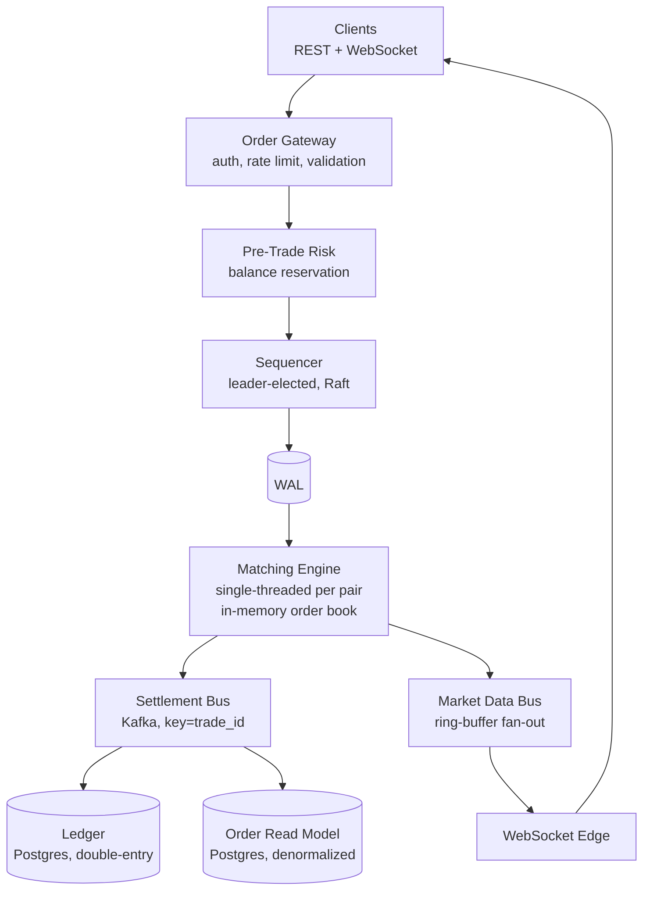

## Prompt 2: Design an Online Brokerage (Robinhood-Style)

Coinbase's published hint specifically names this. Tests order routing, balance checks, market data, settlement.

- *"What if a user places an order, then withdraws their balance before the fill?"* 
- *"What if the matching engine crashes mid-fill?"* 
- *"What if the fill event is processed twice by the ledger?"* 


### Functional Scope
Who's the user? - retail consumer
What is the core flow you want me to focus on - the happy path? - market order fills on a crypto ticker. we also want to read ticker price data.
- limit, market, stop-limit, post-only, immediate-or-cancel, fill-or-kill order types
- Continuous order book with price-time priority (FIFO at each price level)
- cancel and replace existing orders within the same priority window
- Pre-trade risk checks: Verify balance / margin before order
- Real time market data fan-out
What is explicitly out of scope - auth, risk / KYC. Spot only

### Scale and shape
Roughly how many users? - 1M DAU
What's the read/write ratio - 100:1
Is this latency sensitive? - read paths have sub 100ms latency. write paths should be <10ms (not high-frequency trading)
Any 10x spike pattern I should design for - system should be able to handle 100x traffic during extreme load (BTC news)

### Non-functional priorties
For our online brokerage we value correctness and durability over availability and latency. 

### Mental Model

A brokerage's matching engine is structurally different from a normal web service. A normal web app writes to a database, treats the DB as the source of truth, and pays an `fsync` per commit; that pattern is too slow for matching, where we need sub-millisecond decisions. So we invert the model. The order book lives in process memory inside one matching-engine process, durability comes from a write-ahead log, and the database (Postgres for our ledger) sits downstream rather than in the hot loop.

Two consequences fall out. The matching engine becomes a deterministic state machine — given the same input log, every replica produces the same fills and the same final book — which lets us replicate via log-replay rather than distributed locking. And it runs single-threaded per trading pair, with horizontal scale coming from sharding pairs onto different instances (BTC-USD on one engine, ETH-USD on another) rather than sharding users.

### High-Level Architecture



Two paths leave the matching engine. The settlement path (Kafka → ledger) is the write side and demands exactly-once accounting; the market-data path (ring buffer → WebSocket) is the read side and tolerates loss for the sake of low-latency fan-out. Treating them as separate failure domains is the highest-leverage architectural decision in the system.

### The Sequencer and Write-Ahead Log

The sequencer is the single linearization point in front of the matching engine. Every order event flows through it, gets a monotonically-increasing sequence number, and is appended to the write-ahead log. That log is the source of truth; the in-memory book is a derived view. The sequencer is itself replicated using leader-follower replication with a consensus protocol (Raft is the common choice), so the leader can fail over without losing committed events.

Crash recovery for the matching engine is bounded by **periodic snapshots**. Every few minutes a background task serializes the entire in-memory state to disk, tagged with the sequence number it represents. On recovery, a fresh process loads the latest snapshot and replays only the WAL entries after that sequence number. Recovery time is bounded by snapshot cadence, not by how long the system has been running. Hot standby replicas avoid replay entirely by consuming the same WAL in lockstep with the active engine.

### Pre-Trade Risk and Balance Reservation

We must reserve a user's balance at order-placement time, not at fill time. Otherwise a user with $100 could place ten $100 orders that all pass an isolated balance check and overdraw the account. The reservation moves the required notional from `available_amount` into `reserved_amount` synchronously. On fill it converts to a settled debit; on cancel it releases.

We use Postgres for the reservation, not Redis. The 50ms p99 budget is generous for a Postgres conditional update (1–3ms p99) and Redis isn't durable enough to be source of truth for money. The reservation is one transaction: append a row to a `reservations` table for audit, then bump the balance counter with a conditional update.

```sql
INSERT INTO reservations (reservation_id, order_id, user_id, amount, status)
VALUES (:reservation_id, :order_id, :user_id, :amount, 'HELD');

UPDATE balances
SET reserved_amount = reserved_amount + :amount
WHERE user_id = :user_id
  AND (available_amount - reserved_amount) >= :amount
RETURNING reserved_amount;
```

`RETURNING` does real work here: if the `WHERE` clause matched no rows because the user lacked balance, the empty result is the rejection signal in a single round-trip, with no race window between an `UPDATE` and a separate `SELECT`. The separate `reservations` table (keyed by `order_id`) is what makes cancel and fill correct — on cancel we look up the row by `order_id`, read the exact amount, and flip status from `HELD` to `RELEASED` with a guard, making duplicate cancels no-ops.

### Settlement and the Omnibus

The omnibus is the firm's pooled holdings — the actual money in our partner bank account, the actual coins in our wallets — that backs all customer claims. Internal trades don't touch it. When Alice and Bob trade with each other, no money or coins leave the pool; we just adjust who owns what inside it. The journal entries go directly between the two customer accounts: debit Alice's USD, credit Bob's USD, debit Bob's BTC, credit Alice's BTC. The omnibus only takes entries when money or coins cross the platform boundary (deposits, withdrawals, externally-routed orders).

This shifts the hot-row question. The row touched on every trade is the **fee revenue account**, since every match collects a fee. At 10K trades per second that's 10K writes to one row, which sits at the edge of single-row Postgres throughput. The standard fix is sub-account splitting — maintain N fee rows (16 or 32), route each entry by hashing the trade ID, periodically roll up. Modern Treasury has published an alternative async-batching pattern that defers non-balance-asserting entries through a queue. For our scale, sub-account splitting on the fee account is sufficient.

The omnibus still matters because we continuously reconcile the sum of customer claims against the assets we actually hold — bank statement for USD, on-chain balance for crypto, on a few-minute cadence. Drift pages on-call; we never auto-correct financial drift. This is the operational form of the proof-of-reserves story.

End-to-end idempotency at the matching-to-ledger seam uses `trade_id`: assigned by the matching engine, carried through Kafka, enforced by a `UNIQUE` constraint at the ledger insert. WAL replay or Kafka redelivery can't double-credit.

#### Three balance states

Customer balances live in three states. `reserved` is earmarked for open orders and sits in the operational reservations table, not in the immutable ledger. `posted` (or `pending`) is in the ledger but not yet fully settled — instantaneous in T+0 spot crypto, a business day in T+1 equities. `settled` is fully cleared and unrecallable. Risk gates check different fields: outbound to bank or chain checks `settled`; order placement checks `available − reserved`.

### Order State and the Read Model

There's no single component that holds the complete state of an in-flight order. The reservations table knows there's an active hold. The matching engine's in-memory book knows the resting quantity. The ledger knows what's been settled. To answer "what's the state of order X right now?" we'd need to query each.

In practice we build a denormalized read model — an `orders` table updated by a consumer subscribed to events from the matching engine and ledger. The user-facing API queries this single table for status, filled quantity, remaining quantity. It's eventually consistent with the source-of-truth components, lagging by milliseconds. If it gets a bug we rebuild it from event replay; the underlying components remain correct.

This pattern is **CQRS** — Command-Query Responsibility Segregation. Writes go to specialized stores (matching engine, reservations, ledger); reads come from a denormalized projection. Naming this in interview signals you've thought about why writes are split across stores while reads converge into one place.

### Order Types

Beyond market and limit, the order types worth supporting:

- **Immediate-or-Cancel (IOC)**: take what's available now, cancel the remainder. No resting on the book.
- **Fill-or-Kill (FOK)**: all-or-nothing. Cancel everything if the full quantity can't fill in one shot.
- **Post-Only**: only add liquidity. Reject if the order would cross the spread. Used by market makers earning maker fees.
- **Stop-Limit / Stop-Market**: triggered when the market price crosses a stop level, then becomes a limit or market order. Pending stops sit in a separate structure indexed by trigger price and activate as the market moves through them.
- **Self-trade prevention**: a flag, not a type. If the user's buy would match their own resting sell, both cancel rather than trade. Prevents wash trading.
- **Time-in-force qualifiers**: GTC (rest until cancelled), GTD (expires at date), Day (cancel at session end). These govern expiry, not matching behavior.

Naming market, limit, IOC, FOK, post-only as table-stakes with stop-limit as the next tier shows you've thought about the real product surface, not a toy matcher.

### Implementation note: language choice

Java is the dominant production choice for matching engines (LMAX, Coinbase International, traditional venues) because the JVM has mature low-pause GCs (Azul Zing, ZGC) and a deep ecosystem for off-heap memory and low-latency messaging. Rust is the rising new-build choice — no GC, memory safety, performance close to C++. Go is technically capable for our latency budget but isn't the obvious pick for the matching engine specifically; for everything else (gateways, ledger consumers, API layer) Go is fine.

### Failure-Mode Probes

- *"What if a user places an order, then withdraws their balance before the fill?"* The reservation already moved the funds out of `available_amount` at order placement. The withdrawal endpoint checks `settled` (or `available − reserved`), so the withdraw fails for insufficient balance. Reservation is what closes this gap.

- *"What if the matching engine crashes mid-fill?"* The fill is in the WAL before it's emitted to Kafka. On restart, the engine replays from the latest snapshot, re-emits any fills that hadn't yet been published. The ledger's `UNIQUE` constraint on `trade_id` rejects the duplicate, so the user is never double-debited.

- *"What if the fill event is processed twice by the ledger?"* Same primitive: `UNIQUE(trade_id)` at the ledger insert. The second insert fails on the constraint and the consumer treats the duplicate as a successful no-op.
