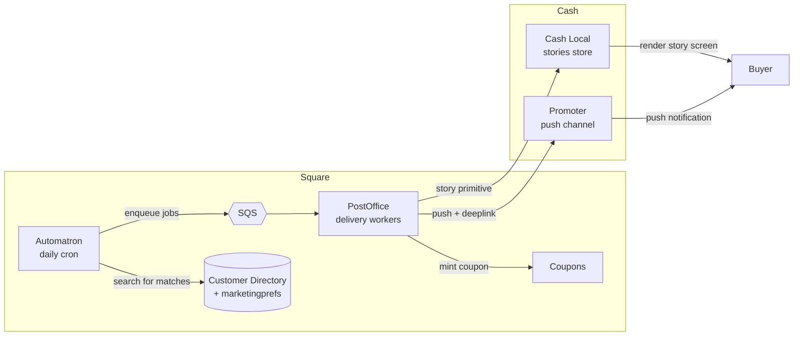
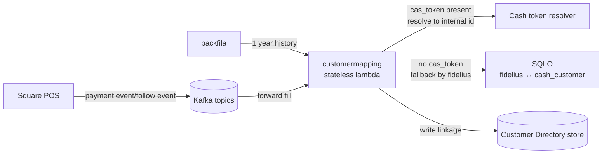

## Project description

Cash App and Square are two massive networks owned by the same company, never connected — every prior attempt to bridge them had stalled on technical and organizational complexity across the BUs. Cash Neighborhoods was Block's latest bet on connecting Cash App users to local sellers (neighborhoods).

- **Targeting Cash Neighborhoods customers (Buyers).**
  - These are customers in the program — buyers who use Cash App at merchants in the network.
  - Winback fires when a customer made a purchase at the seller's store but hasn't returned in 14 days.
- **Sellers** who join the network get 1% payment processing and access to their Cash-side customer base.
  - Customers in the "local" network who have visited the seller's store appear in the directory on day one.
  - Today access is via automations; blast campaigns and omni-channel marketing are next.
- **Winback feature** receive a push notification into Cash App rendered as a "story-like" message.
  - The message carries an item recommendation and a coupon.
  - Tapping the push lands the buyer directly on the story screen.

I was the engineering DRI, leading a team of 4 engineers and coordinating across 3 partner teams plus XFN partners spanning data, mobile, product, legal, and design. My work split across research and technical spec writing, work planning, and running the team rituals — standups, syncs, retros.

Two things I want to highlight: One key architectural decision — where to build it, Cash App or Square — and one major technical issue we hit during early release, when our customer linkages weren't yielding the matches we needed.

We shipped on schedule in early October. The launch pulled a 7% follow-through purchase rate from buyers — 7x traditional text-message marketing

--- STOP --- 

## Architecture - Square owns marketing, Cash owns delivery

- Square and Cash app had separate messaging platforms
  - Square: Automatron
    - Our team - start of operation
    - Cron runs daily - searches customer directory for customers that match our strategy (winback)
    - Sends events to postoffice via SQS, which is then picked up by delivery workers
  - Square: postoffice 
    - Our team. Platform for marketing messages from sellers to customers
    - SMS and Email channels
    - Multi-tenanted - promotions are scoped to merchant
    - Rich marketing features such as templates, themes, automations
  - Square: coupons
    - Our team. Go service that issues coupons (discounts)
    - Is part of the call path at delivery
  - Square: customer directory
    - Sister team - owns customer database for sellers
    - Used by marketing (postoffice) as the source of truth of customers sellers can target to
    - Also related - marketingprefs - for auditable marketing consent of our buyers
  - Cash: promoter
    - Internal message platform used for internal marketing "Try out cash app loans"
    - SMS, email, and push channels
    - Single tenant
  - Cash: cash-app-local
    - Sister team
    - Backend powering "neighborhoods" tab 
    - Denormalize "marketing" data into "stories" store

**The decision:** Square owns the marketing logic (templating, versioning, customer directory, targeting). Cash owns the delivery rail. Local powers the app. Shared communication with RPC.

**Rejected alternatives:**
- *Rebuild in one side (either Square or Cash App).* 2+ quarters, duplicates infra. PostOffice in particular has multi-tenant templating, themes, automations — a feature set built up over years that we needed on day one. Rebuilding it inside Cash would have produced a worse copy on a longer timeline. Lifting PostOffice into Cash's environment also doesn't make sense — it still serves a large existing Square traffic load and has to keep running where it is. Rejected on both cost and long-term coupling.
- *Build a thin shared service in the middle.* Tempting — it's the "platform" answer. Rejected for v1 because nobody owned the middle, and a middle layer with no team is worse than a clear seam between two teams that do exist. Worst of both worlds.

--- STOP --- 

### How a winback message gets delivered

A daily Automatron cron sweeps the Customer Directory's search endpoint for the trigger condition — "buyers who made a purchase but haven't returned in 14 days." For each match, we issue a coupon via the Coupons service, assemble a payload, and send two messages out the door:

- A **story primitive** to Cash Local (the neighborhoods tab backend). The story carries the target Cash token, the images and text, and the coupon code with its expiry. Cash Local denormalizes it into its stories store so it's ready to render in the neighborhoods tab.
- A **push notification** to Promoter, with a deep link to the story screen.

When the buyer taps the push, the app opens the story screen directly. If the story has expired by then, the deep link falls through to the neighborhoods tab so the customer still lands somewhere coherent.

SMS and email stay entirely inside Square — PostOffice owns those rails as before. Only push goes through Promoter, because push delivery into Cash App is identity-bound to the Cash customer and only Cash can issue it.

### Promoter as a single-tenant service

Promoter never became multi-tenant for this project. From its perspective it still has one tenant — Cash internal marketing — and we use it as a one-off direct-delivery channel: each push is a self-contained message we hand off with all the context it needs. Multi-tenant scoping (which Square seller, which campaign, which customer) lives entirely in our records on the Square side. Promoter only retains the delivery receipt.

This was a real scope cut. Extending Promoter into a true multi-tenant platform would have meant a separate engagement with the Promoter team and probably its own quarter of work. Treating it as a delivery primitive instead let us ship without that dependency.

--- STOP --- 
### Failure modes and idempotency

- **Promoter is down or slow.** PostOffice sees a failed delivery and retries with exponential backoff. If no successes land within SLO, oncall is paged. The send keeps trying until it succeeds, drops out the back of retry, or someone intervenes — no silent loss.
- **Retries don't double-send.** Every delivery is idempotent on `(merchant_id, promotion_id, customer_id)`. If the same logical send reaches Promoter twice, only one push goes out.

### Search automations vs event-driven

Most automations on PostOffice are event-driven — a buyer makes a purchase, an event fires, the automation reacts. Winback is different: the trigger condition is the *absence* of an event ("buyer hasn't transacted in 14 days"), and there's nothing to listen to. So winback is a **search automation** — Automatron runs a daily search against the Customer Directory's search endpoint and treats the result set as the trigger.

This is why winback is a cron rather than a stream consumer — and it's also why it has the cold-start problem described next.

## Technical challenge — Customer matching

Precedence: payment-event link wins over SQLO (POS `cas_token` is strongest signal, robust to card-sharing). `customermapping` is the stateless matcher; the Customer Directory service reads the resulting linkage store to power both the merchant client and Automatron.

---

Square and Cash App had two separate customer databases that didn't share IDs. On the Square side a customer was an opaque token like `ABC`. On the Cash side, every customer had an internal token (`c_0123`) and an externally-shareable one (`cas_0123`). To power winback, we needed to connect both the customer profiles *and* the payments those customers made.

### How we matched customers

We had two things to match:

- **Profile match** — done in our `customermapping` service. We compared standard personal details (email, first/last name, address) and combined them into a single confidence score. We only accepted matches above 95%. 
- **Payment match** — done by credit card. We used a stand-in for the card called a *Fidelius* token, issued by our internal card server to get around PCI DSS. 

### Forward fill — handling new payments and profiles ("followers") as they come in

Forward fill for profiles comes in a kafka topic for new followers.

For payments, we used the payment kafka topic. Payment event carries a Fidelius token the customer's external Cash token (`cas_0123`) if the payment came from Cash app pay (CAP) and Cash app card (CAC).

`customermapping` is a small stateless service (a lambda). When it sees an event with a Cash token, it asks Cash to resolve that token to the internal customer ID, then writes the connection into the Customer Directory store.

### Backfill — connecting customers from before they joined

A core selling point was: when a merchant joins Cash Neighborhoods, their existing Square customers show up matched on day one — not weeks later. To deliver that, we backfilled the past year of Square payments — the same window that the predecessor feature, **Cash Local**, had retained. Backfill ran through the same `customermapping` pipeline, just driven from a dedicated backfill service (backfila) instead of the Kafka stream.

Forward-fill and backfill divided the timeline by a cutoff date so they couldn't fight over the same payment, and both deduplicated on `payment_id` — so retries and replays converged on a single record.

### Important disclaimer
Once we connected a Square customer to a Cash customer, we couldn't change that easily later. Two things would break:

- **Winback would silently misfire.** Winback fires when a customer hasn't been back in 14 days. If we mistakenly attributed customer B's payment to customer A, our system would think A had returned and skip the winback that should have gone out. There's no error to catch — the campaign just quietly underperforms.
- **The merchant's directory app would show wrong data.** Each Square customer's payment history shows up in the merchant's Customer Directory app. 

So keeping the connection stable was a product requirement, not just a tech-debt concern.

--- STOP ---
### The issue — and what fixed it

When we launched to a small pre-beta group, our matched-payment numbers came in well below what data science had projected. The expectation, based on Cash Local's history, was at least one matched payment per linked Cash customer. We weren't close.

The problem held for one to two weeks. The Customer Directory team tried fixes from inside their own scope — tightening match thresholds, replaying events — but nothing moved the number. Going into week two, I took the lead on the remediation.

The diagnosis was simple in hindsight: most Cash Local customers weren't actually paying with CAP or CAC. The `cas_token` we were counting on rarely showed up on Square payment events, so both forward and backfill had almost nothing to connect

I pulled in our data scientist, a Cash Local engineer, and the Customer Directory lead. Together we surfaced a service we hadn't been using: **SQLO**, which already had a `fidelius ↔ cash_customer` mapping built for our predecessor features. It was solving our problem but it does introduce a point of failure in the hot path. We added a SQLO lookup as the fallback when an event came in without a `cas_token` with cache. Matched-payment volume came back to projection.

SQLO is a bridge, not where we want to end up. The proper long-term fix is upstream: have the POS attach the `cas_token` whenever a Cash customer is signed in, regardless of how they actually pay. The Fidelius cache helps in the meantime — if SQLO has an incident, only first-time-seen cards are affected; everyone else continues to match against the cache.

### Throughput

The matching pipeline sits on a high-volume topic, but each event is cheap:

- **Most events exit immediately.** About 99% of Square payment events aren't from Cash Neighborhoods merchants. Those take a single index lookup and return without any external service call.
- **Repeat customers hit a cache.** Once we've resolved a card-to-customer mapping, the next payment on the same card uses the cached answer instead of calling out again.
- **Per-event timing doesn't matter.** As long as the Kafka topic isn't backing up, we're fine. We don't need millisecond delivery into the directory.

We deliberately didn't build cache invalidation. When a card is reissued or revoked, it stops appearing in payment events at the source, so any stale cache entries naturally age out as new payments push them down. We accepted this rather than build a card-invalidation feed for v1.

### Which match wins when both apply

The payment event always wins. The `cas_token` attached at the point-of-sale tells us exactly which Cash customer authorized the payment. SQLO's `fidelius → cash_customer` mapping is right most of the time, but it falls apart whenever a card is shared — a family card, or a partner using a spouse's card. In those cases SQLO would attribute B's payment to A, but the live POS token wouldn't. So the rule is: trust the payment event when it's there, only fall back to SQLO when it's missing.

### What I'd do differently

The "CAP and CAC will dominate payments" was an assumption. I never questioned it from directory's design, a miss on my part. Our conversations with the cash leads had spoken about this multiple times but no one push back, I had assumed it was correct. I think I could've also jumped in earlier to rememdiate. 

The lesson: when a single assumption sits underneath the design, call it out in the spec — *"this design assumes X, here's the data that confirms X"* — and treat any unvalidated one as a launch blocker, not a footnote.

## Appendix - Future iterations
- Cleaning up SQLO / customer matching hot paths. Right now the reliance on SQLO is a GA blocker. We need customer information to come down the payment pipeline.
- Omni-channel marketing - this is already in place. From a marketing perspective, sellers should not have to consider per-channel marketing effectiveness - we know that. We implemented omni-channel marketing as a next step - 1 promotion -> multiple channels (tmm, email, cash app)

## Appendix - Automatron SQS vs Kafka

Today Automatron emits jobs to PostOffice over SQS. This is pre-existing tech debt and I'd argue it should be Kafka instead. The pain shows up on cold-start automations.

**The cold-start problem.** When a seller creates a new automation — say, "winback every customer who paid me but hasn't been back in 14 days" — the first run sweeps the entire customer directory and emits a flood of jobs all at once. PostOffice handles the surge fine on its own; it's built to be highly concurrent. The problem is downstream. Workers fan out in parallel and call services like the catalog to enrich each message, and the catalog gets overwhelmed by the sudden concurrency.

**Why caching alone didn't fix it.** The natural fix was to cache catalog data per merchant — most jobs in a single automation run hit the same handful of catalog rows. But because SQS workers pull jobs in parallel with no affinity, every worker on the cold-start surge hits an empty cache at the same time and races to fill it. A thundering herd on the catalog, just one layer down. The cache helped steady-state but didn't solve cold-start.

**Why Kafka fits better.** The key insight: we don't actually want parallelism *within a single merchant's hydration surge*, we want it for delivery

- **Partition by `merchant_id` to warm caches naturally.** We batch delivery events and send them single file into a consumer. Every job for a given merchant lands on the same worker. That worker fills the catalog cache once on the first job and reuses it for the rest of the surge — no race, no thundering herd. Other merchants' surges run in parallel on other workers, each warming their own cache once. Total throughput goes up; catalog QPS goes down.
- **Backpressure for free.** If catalog gets slow, Kafka consumers slow down with it. Lag grows but nothing is dropped or DLQ-bounced. SQS gives us the opposite — workers keep pulling, downstream falls over, retries pile up in the DLQ.
- **Replay is cheap.** A botched automation run can be reprocessed from a known offset without re-running the directory scan. SQS replay is per-message and harder to reason about.

Two-stage pipeline:
- **Stage 1 (enrichment topic):** partition by `merchant_id`. A surge for one merchant lands on one (or a small number of) workers, the catalog cache warms once, and every job in that surge reuses it. Output is an enriched, fully-rendered message written to a second topic.
- **Stage 2 (delivery topic):** partition by `customer_id` (or anything with no affinity requirement). Delivery workers fan out as wide as the partition count allows. A large seller's 100K-customer surge spreads across the full pool, exactly the parallelism we want.

The cost of all this is operational — Kafka is heavier to run than SQS, and a two-stage pipeline has more moving parts — but the workload's defining shape is *correlated upstream, parallel downstream*, and that's exactly what two stages give us.
