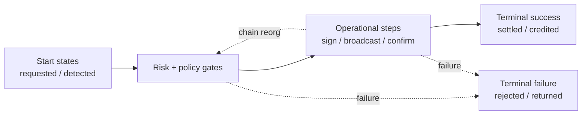
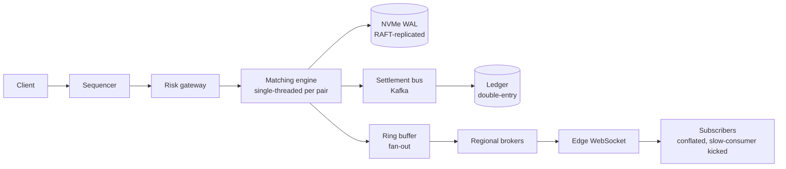

# Coinbase Staff System Design: Crash Course

A self-contained guide for the **Staff Software Engineer, Backend (Consumer — Retail Cash)** loop. Read this before any Coinbase system design round.

> **How to use this:** the goal is not to memorize Coinbase's internal stack. It is to walk into the room with a small, sharp mental model — money flow, custody tiers, blockchain finality, compliance — and apply it to whatever problem they hand you. Names like "Aeron" and "ChainStorage" are *vocabulary* you can drop once to show you've read the blogs; the patterns underneath are what they actually probe.

**Role-specific lens.** Consumer-Retail Cash owns the cash on/off ramps, retail balances, deposit/withdrawal pipelines, and the customer-visible money surface. Bias your prep toward **ledger, deposit/withdrawal pipelines, idempotency, KYC, compliance, reconciliation**. De-emphasize matching-engine internals, MPC math, and ML feature platforms — know they exist, don't go deep.

---

## How Coinbase Thinks About Architecture

Coinbase is a regulated, custody-grade, 24/7 financial platform serving **~110M verified users**. Three constraints drive every design decision:

1. **Customer fund safety is the top priority.** The system is judged on whether $1 of customer crypto ever leaves without authorization. **~98% of customer assets** live in air-gapped cold storage. Multi-tier custody (hot/warm/cold), MPC, HSMs, and multi-sig are first-class architectural concerns — not bolt-ons.

2. **Volatility is the design target.** During BTC pumps or ETF approvals, traffic spikes **10x**. Identity service serves **1.5M reads/sec** at peak. Trading halts on **>10% price moves in 5 minutes** — *consistency wins over availability for money paths*. A design that handles steady-state but collapses during a pump fails.

3. **Compliance is structural, not a sidecar.** KYC tiers, OFAC screening, Travel Rule (>$3K), SAR filing (>$10K daily), audit immutability, jurisdiction policy, and per-state US licensing live in the **first** architecture diagram. "Bolt-on compliance" is a top reject pattern.

**Framing line for any Coinbase problem:** *"At its core this is a regulated financial system with custody-grade security. Protect customer funds against worst-case adversaries, design for 10x volatility spikes, and treat compliance as architecture from minute one. When money flows: double-entry append-only ledger. When chains are involved: reorgs are expected. Fail-closed for money paths, fail-open for read paths."*

This is the inverse of Shopify's mental model. Shopify protects revenue paths with fail-open and tiered degradation. Coinbase protects fund-safety paths with fail-closed and conservative defaults.

---

## The Coinbase Interview Loop (Staff / IC6)

1. **Recruiter screen** (30–45 min) — background, motivation, cultural-tenet alignment.
2. **Triple-set screen** — CCAT (~15 min cognitive), values test (~15 min), CodeSignal (90 min, 4 problems, **production-quality** code expected, not LeetCode-optimal).
3. **Hiring manager screen** (45–60 min) — behavioral + scope.
4. **Pair programming / "machine coding"** (60–90 min, sometimes two). Build a real subsystem incrementally as requirements expand. **This is where most candidates fail** — production-grade code with clean naming and separation of concerns, not LeetCode optimization.
5. **System design** (60–90 min). Whiteboard / Excalidraw. Problems are larger than the slot — they stop you when they have signal, not when you "finish."
6. **Reverse system design** (IC6+, 45–60 min). Walk through a real system you've built. Coinbase's published guidance: *"if you know the basics of an online brokerage, you're about as ready as you can be"* — bring real-time price feeds, multi-exchange aggregators, or trading-system components.
7. **Behavioral / leadership** (45–60 min). STAR format mapped to the 10 cultural tenets.
8. **(IC6+) Senior leadership cross-functional** (60 min) — director or VP. Strategic vision, business judgment.

**Bar Raiser system.** Every panel has at least one trained bar raiser with explicit veto. *"If you're not a hell yes, you're a no."* A "maybe" rounds to "no." Worst round can sink you even if the others were strong.

**Top rejection cause** (Coinbase blog): *"Most candidates who fail do so because their code or process isn't good enough."* Sloppy pair-programming code is the #1 killer.

---

## Cultural Tenets That Show Up in Design Rounds

| Tenet                                    | What it looks like in system design                                                                                                       |
| ---------------------------------------- | ----------------------------------------------------------------------------------------------------------------------------------------- |
| **#SecurityFirst**                       | Custody, KMS, MPC, multi-sig in the *first* diagram. Audit trail non-optional.                                                            |
| **#ExplicitTradeoffs**                   | Every choice paired with the rejected alternative + reason. *"Postgres over DynamoDB because we need multi-row transactions; we pay with horizontal scale ceiling, mitigated by sharding."* |
| **#BuildValue**                          | Don't reinvent Kafka, Redis, Postgres. Do build the matching engine, custody flow, ledger, compliance engine.                             |
| **Act Like an Owner**                    | Walk through cost, on-call, observability, blast radius, capacity. Not just "the system works."                                           |
| **Tough Feedback / Continuous Learning** | When pushed back on, react curiously. *"Being wrong with confidence is a negative signal; humility is a positive signal"* (Coinbase).     |

The single biggest staff-level differentiator: **explicit tradeoffs paired with rejected alternatives.** Make it audible.

---

## Blockchain Primer (Just Enough)

You don't need a deep crypto background for Consumer-Retail Cash. You need three concepts:

1. **Finality.** A transaction is *practically irreversible* after N confirmations. Different chains have different N (Bitcoin: 3–6; Ethereum: 12; Solana: ~12.8s slot finality). For larger amounts, wait for more confirmations.
2. **Reorgs.** Chains can rewrite their recent history when a competing fork wins. Anything pending below your confirmation threshold can disappear. Reorgs are **expected**, not exceptional.
3. **On-chain vs off-chain.** Coinbase↔Coinbase transfers are *off-chain* book transfers in the internal ledger (instant, free). Anything crossing the perimeter (deposit in, withdrawal out) is *on-chain* and subject to finality and reorgs.

That's enough to reason about every Consumer-Retail problem. If asked about a specific chain's quirks, say "I'd defer to per-chain ops on the exact threshold; the architectural pattern is a confirmation-policy table joined per asset."

---

## The Technology Stack (3-Picks-Per-Layer)

Keep it minimal in interview. Three tools per layer is plenty. Justify each by **what it gets you and what you're paying.**

### How to make tech decisions on the whiteboard

1. **Start from the consistency story.** Money path → strong consistency → Postgres. Read fan-out → eventual ok → cache or DynamoDB.
2. **Pick the simplest thing that fits the access pattern.** A user's last 100 trades = KV, not a join.
3. **Name what you're rejecting and why.** "I'm not using DynamoDB here because I need a multi-row transaction across debit and credit rows."
4. **Quote a number.** "Single Postgres handles ~10K writes/sec; we'll shard by `user_id` past that."

### Storage

| Tool                        | Use it for                                                              | Pay with                                      |
| --------------------------- | ----------------------------------------------------------------------- | --------------------------------------------- |
| **PostgreSQL**              | Ledger journal, withdrawal state, KYC state, anything ACID              | Single-node ceiling (~5–10K writes/sec); shard by `user_id` past that |
| **DynamoDB**                | High-throughput KV: identity hot reads (1.5M reads/sec), session state  | No multi-row transactions; single-table modeling discipline |
| **S3**                      | Raw blocks (immutable), KYC document vault, audit cold tier (5–7yr)     | Eventual consistency on overwrites; latency  |

Why not pick more? You can hand-wave Redis (rate limits, hot caches) and a data warehouse (analytics, model training) without making them stack-defining choices.

**Why Postgres for the ledger, not DynamoDB?** The ledger needs ACID across debit + credit rows (atomic two-row write). DynamoDB transactions are scoped tightly and the modeling cost is high. Postgres gives multi-row transactions natively and the write ceiling is solvable with sharding.

### Messaging

| Tool                        | Use it for                                                                | Pay with                                      |
| --------------------------- | ------------------------------------------------------------------------- | --------------------------------------------- |
| **Kafka**                   | Event backbone: settlement bus, CDC, deposit/withdrawal events            | Operational complexity; partition-key choices are sticky |
| **Temporal**                | Long-running orchestration: KYC, withdrawal pipeline, signing ceremonies  | Cluster ops or Cloud cost (priced per workflow-action over its lifetime); workflow code must be deterministic |
| **Redis (pub-sub / ZSET)**  | Sub-ms hot-path needs alongside the durable store                         | Memory-bound; not a system of record         |

**Cons of Temporal worth saying out loud:** "Great for multi-step async with crash-resume. Overhead is non-trivial for short synchronous tasks, and long-running workflows accrue cost for their full lifetime. I'd reach for it on KYC and withdrawals, not for a single API call."

### Edge / Caching

- **CDN** for static assets and public market-data snapshots (5–30s TTL on "top trending").
- **WAF + L7 rate limiting** at the edge for OFAC pre-checks, abuse mitigation.
- **Multi-region anycast** for routing; central source of truth (matching engine, ledger primary) regardless.

### Capacity numbers worth memorizing

| System                          | Throughput            | Latency       |
| ------------------------------- | --------------------- | ------------- |
| Postgres single node            | **5–10K writes/sec**  | 1–10ms        |
| DynamoDB                        | **100K+ ops/sec**     | <10ms p99     |
| Redis single node               | **100K+ ops/sec**     | <1ms          |
| Kafka per partition             | **10–100K msg/sec**   | 1–10ms        |
| WebSocket fan-out per node      | **10–50K conns**      | 10–100ms tick |

If you cite one number per architectural claim, you're already ahead of most candidates.

---

## Architecture Patterns

These are the patterns to internalize. You won't use all of them in one interview — pick the 3–4 that fit the problem.

### 1. Double-Entry, Append-Only Ledger

**Frame it:** *"When money flows, balances are derived from an immutable journal of debits and credits, not stored as mutable fields. Every transaction produces two equal-and-opposite journal entries; the sum on an account is the balance; corrections are reversing entries, never updates."*

This is the FinHub-Ledger team's signature design. Open any money-touching problem with this framing.

**Why mutable balances fail:**
- Race conditions on the balance row (two writers decrement from a stale value)
- No audit trail
- No replay
- No reconciliation against external truth (chain, bank)

**Why double-entry wins:**
- Atomic two-row write in one DB transaction
- Journal *is* the audit trail by construction
- Replay rebuilds any balance from `SUM(credits) - SUM(debits)`
- Reconciliation is a continuous diff against the journal

**Cons (say these out loud to show tradeoff awareness):**
- Storage grows linearly forever; you'll need cold-tier archival
- Balance reads are aggregations, not lookups — needs snapshots/caches
- Hot accounts (the exchange omnibus) contend on a single row at very high TPS — split into N sub-accounts and rollup offline
- Schema migrations are painful because old entries are immutable

### 2. State Machines for High-Stakes Operations

**Frame it:** *"Operations that touch money or compliance involve multiple steps that can fail at any boundary. The pattern is a durable state machine where every transition is an idempotent journal entry. Recovery walks the state machine forward (or compensates) — never ad-hoc rollback."*

You don't need to memorize the exact states. Memorize the **shape**:

In interview, **derive the specific states with the interviewer.** Coinbase explicitly probes *"what happens if the process dies between step N and N+1?"* — the answer is "the workflow resumes from the durable state; activities are idempotent so retries are safe."

### 3. Multi-Tier Custody (Hot / Warm / Cold)

**Frame it:** *"Customer crypto must be safe from external attackers, insider threats, and `$5 wrench` coercion of any single human. Multi-tier custody distributes risk: ~2–5% in HSM-backed hot, 5–20% in MPC/TSS warm, 75–98% in air-gapped cold."*

| Tier     | What lives there                | How it signs                            |
| -------- | ------------------------------- | --------------------------------------- |
| **Hot**  | Operational liquidity (~2–5%)   | HSM-backed; key never exportable        |
| **Warm** | Mid-size institutional (5–20%)  | MPC threshold signing across HSM zones  |
| **Cold** | Bulk reserves (~75–98%)         | Air-gapped multi-sig with quorum approvers + ceremonies |

**HSM** = Hardware Security Module. A tamper-resistant device that holds private keys and signs *inside* the device — keys never leave. Think "vault that signs but never lets you peek inside."

Funds move *down* tiers continuously (deposits sweep to cold). Funds move *up* only via slow human ceremonies. **No automated cold→hot path.**

For Consumer-Retail Cash you mostly interact with the hot tier and the policy gates that decide what gets sent there. Don't go deep on MPC math.

### 4. Idempotency End-to-End

**Frame it:** *"Every operation across multiple systems must be replay-safe. A client retry should not double-charge. A failover between signing and broadcast should not produce two on-chain transactions. The pattern is an idempotency key propagated end-to-end with each layer deduping."*

**Key derivation:**
- **Client-initiated:** `(user_id, intent_id)` from client
- **System-initiated:** `(source_system, source_event_id)` (e.g., `(matching_engine, fill_id)`)
- **Chain-initiated:** `(chain, txid, log_index)`

**The failover trap.** Idempotency keys are scoped to a single backend. If a withdrawal request to HSM-East times out and you retry the *same key* against HSM-West, the second HSM has no record and signs a fresh tx with a different nonce. Now two valid signed txs hit the network. **Fix:** namespace per-backend (`hsm-east:abc-123`) AND check status on the original backend before failover. This is *not* a distributed-key-generation issue — it's a retry-path duplication issue.

### 5. Reconciliation as a First-Class Subsystem

**Frame it:** *"Two sources of truth must continuously agree. Internal ledger ↔ blockchain state. Internal ledger ↔ bank statements. The pattern is a continuous reconciler that diffs both sides, alerts on drift, and never auto-corrects financial drift."*

**Tiers:**
- **Continuous (per-event):** every chain confirmation diffs against the journal entry that should exist. Lag > **30s** alerts.
- **Periodic (per-block, per-batch):** sweep recent blocks, compare ledger state.
- **End-of-day:** full snapshot reconciliation for compliance.

**Auto-correct policy:**
- Cache / derived-state drift → auto-correct (re-derive from journal)
- **Financial journal drift → never auto-correct.** Page on-call, manual investigation.

This is what separates audit-ready from "works in dev."

### 6. Per-Chain Confirmation Policy and Reorg Awareness

**Frame it:** *"Each blockchain has a different finality model. Treating them uniformly is wrong. The pattern is a per-chain confirmation policy table, with reorg as an expected state transition."*

| Chain          | Default confirmations |
| -------------- | --------------------- |
| Bitcoin        | **3–6** (amount-tiered) |
| Ethereum       | **12**                |
| Solana         | Slot finality (~12.8s)|
| Polygon        | **256 blocks** (~8–10 min) |
| L2 rollups     | Depends on L1; optimistic rollups have 7-day challenge windows |

**Reorg handling logic:**
1. Block ingested → emit "tentative" event
2. Confirmation count crosses threshold → emit "finalized" event, credit ledger
3. Reorg *below* finalized threshold → page on-call (your threshold was wrong)
4. Reorg *above* threshold but *below* finalized → reverse tentative credits

### 7. Defense in Depth on Money Movements

**Frame it:** *"Money movement passes through multiple independent gates so compromising one (stolen 2FA, phished account) doesn't bypass the rest. Cheapest gates first to fail fast."*

Withdrawal gate ordering:

1. Authentication / 2FA
2. Velocity limits (per-asset, per-day)
3. Allowlist (48-hour wait on new addresses)
4. OFAC sanctions screening
5. Travel Rule data collection (>$3K)
6. Address risk score
7. ML fraud score
8. Policy gate (jurisdiction, KYC tier)
9. Hot-tier capacity check
10. Sign + broadcast + N-confirmation watch

The **$320M crime insurance policy is contingent on this defense-in-depth posture.**

### 8. Compliance as Architecture

**Frame it:** *"KYC, OFAC, Travel Rule, SAR, audit immutability, retention, jurisdiction policy — first-class services with versioned policies, drawn into the first diagram."*

| Compliance concern   | Architectural primitive                                                  |
| -------------------- | ------------------------------------------------------------------------ |
| Audit immutability   | Append-only journal + hash-chained audit log with externalized roots     |
| KYC tier gating      | Tier engine queried on every fund-touching action                        |
| Travel Rule (>$3K)   | Withdrawal gate; originator/beneficiary metadata in tx context           |
| SAR (>$10K daily)    | Streaming aggregation; auto-generated case for filing                    |
| OFAC sanctions       | Address screen on every outbound; periodic re-screen                     |
| Jurisdiction policy  | Policy table joined on `user.jurisdiction` at decision time              |
| Retention (5–7 yr)   | Tiered storage with cold-archive lifecycle                               |
| Re-KYC trigger       | Event-driven (jurisdiction change, high volume) + periodic               |

### 9. Predictive Autoscaling for Volatility

**Frame it:** *"Coinbase load is bimodal. Reactive autoscaling can't react fast enough — by the time the metric crosses threshold, the spike has started. The pattern is predictive: forecast spike windows from upstream signals (price moves, scheduled ETF decisions, halvings) and pre-warm 30–60 minutes ahead."*

**What to actually say in interview** (don't try to design the forecaster):

> "I'd assume a forecasting service exists upstream that classifies spike windows from price action and calendar events. Architecturally, it pre-warms DB replicas, app servers, WebSocket terminators, and hot-wallet liquidity 30–60 min ahead. Reactive autoscaling backstops the long tail. The point is we can't cold-start a Postgres replica in the time it takes BTC to move 10%."

Pair with **circuit breakers** for the unforecasted long tail and **per-tier capacity headroom** for steady state.

### 10. Two-Path Architecture (Trading vs. Market Data)

You probably won't get this for Consumer-Retail Cash, but if asked: trading systems split into **hot loop** (sequenced matching, sub-ms, in-memory) and **fan-out path** (millions of slow consumers, conflated, lossy at edges). Two failure domains, two SLAs.

State this split in the *first sentence* of any trading or market-data answer. For Retail-Cash, just know it exists.

---

## Patterns for Specific Problem Domains

Compressed framings — pick the relevant one and expand only what the interviewer probes.

### Financial Ledger *(highest priority for this role)*

*"A double-entry append-only journal with derived balances, end-to-end idempotency, and continuous reconciliation against external sources. The hard subproblems are concurrency on hot accounts, cross-system saga compensation, and reconciliation drift detection."*

- Double-entry, append-only journal — never mutable balance fields
- **Integer smallest-units + explicit currency code, never floats**
- Idempotency keys with `UNIQUE` constraints as last-line defense
- Sub-account partitioning for hot accounts (omnibus split into N rows)
- Outbox pattern for atomic publish-after-commit to Kafka
- Continuous reconciliation: chain ↔ ledger, bank ↔ ledger
- Cost-basis tracking (FIFO/LIFO/HIFO) for tax
- **5–7 year retention** with tiered storage
- Shard by `user_id` past **~10K writes/sec**

### Deposit / Withdrawal Pipeline *(highest priority for this role)*

*"The operational seam between blockchain state and the internal ledger. Hard subproblems: reorg handling, idempotent state transitions across many systems, mempool dynamics (RBF, ETH nonce ordering), and reconciliation."*

- Deposit state machine with reorg branches
- Withdrawal state machine with cheap-first policy gates
- Per-chain confirmation policy with amount-tiered thresholds
- Signing dispatch by tier (HSM hot, MPC warm, multi-sig cold)
- **RBF** (Replace-By-Fee) for stuck BTC; gas escalation for stuck ETH (preserve nonce ordering)
- Batch withdrawals (combine N customers' outputs into one ETH tx) with saga compensation
- Reconciliation: continuous + periodic + EOD; never auto-correct journal drift
- Operational tooling: dashboards, manual ops console, kill-switch

### KYC and Onboarding *(high priority for this role)*

*"A regulated workflow problem — multi-step, multi-vendor, multi-jurisdiction, save-resume across sessions, with risk-based decisioning. Hard subproblems: workflow durability, vendor abstraction, jurisdiction policy as data, and PII handling."*

- Workflow orchestration (Temporal) for durable multi-step async
- Per-jurisdiction tier matrix as **data, not code** (`if state == "NY"` is a reject signal)
- Vendor abstraction (Onfido / Persona / Jumio interchangeable)
- Sanctions screening with partial-match handling, periodic re-screening
- Risk-based decisioning (doc + sanctions + fraud + behavioral)
- Manual-review queue with case management, SLA, audit trail
- PII vault (S3 + KMS field-level encryption); redaction in non-prod
- Re-KYC: periodic + event-triggered (jurisdiction change, high volume)

### Custody and Wallet *(know-the-shape)*

*"Security-first, optimized for the worst-case adversary. Multi-tier funds segregation (hot/warm/cold), threshold signing, defense in depth, explicit insider-threat modeling."*

- Hot/warm/cold split (~2–5 / 5–20 / 75–98%)
- HSM for hot, MPC for warm, multi-sig + air-gap for cold
- Insider threat as first-class: no single human can move funds; quorum + cooling-off

### Blockchain Indexing *(know-the-shape)*

*"Multi-chain ingestion: the chain is source of truth, a normalized event schema is the abstraction layer. Hard subproblems: reorg handling, per-chain throughput specialization, storage layering."*

- Per-chain pipelines (the Solana I/O lesson) with normalized output schema
- Reorg as a first-class state transition
- Storage layering: raw blocks immutable in S3, derived indices in DynamoDB/Postgres
- Re-derivation on schema change without re-ingesting from chain

### Trading Engine, Market Data, Fraud *(very low priority for this role)*

Know they exist, name-drop the patterns once (two-path, single-threaded matching, online/offline ML parity), and pivot back to the money-movement architecture. A Consumer-Retail Cash interviewer is unlikely to push deep here.

---

## Common Mistakes That Fail Candidates

Rank-ordered by frequency:

1. **Generic SaaS framing.** Treating Coinbase like Twitter or Uber. No nod to ledger correctness, custody tiers, blockchain finality, irreversibility of fund movement, 24/7 ops.
2. **Mutable balance fields / floats for money.** `UPDATE accounts SET balance = balance - 100` is an instant signal of "doesn't understand financial systems."
3. **Treating broadcast as "done."** A withdrawal isn't done until **N confirmations**. Mempool replacement, gas escalation, reorgs all happen between broadcast and finality.
4. **No reorg handling.** Treating chain reorgs as exceptional rather than expected.
5. **Bolt-on security and compliance.** KYC, OFAC, audit log added at the end of the design.
6. **Mixing trading hot loop with market data fan-out.** Slow consumers poison the matching engine.
7. **Single global circuit breaker.** "Stripe is down" globally takes out healthy regions. Always scope.
8. **Fail-open for money paths.** Coinbase is the inverse of Shopify. For money, fail-closed wins.
9. **Same idempotency key across signing backends.** Failover produces two valid signatures.
10. **One Kafka cluster across chains.** Per-chain clusters; isolation matters.
11. **Hardcoded jurisdiction logic.** Jurisdiction is a data table, not `if` statements.
12. **Treating KYC as one-time.** Re-KYC on jurisdiction change, periodic refresh, event-triggered re-screen.
13. **No reconciliation.** A single source of truth with no continuous diff against chain/bank state is audit-hostile.
14. **Wrong-with-confidence under pushback.** When challenged, defending stubbornly is a negative signal.
15. **Overstating scope in behavioral.** Inflated "I led X" when you were a contributor. Bar raisers cross-check.

---

## Coinbase-Specific Vocabulary

Drop once to signal you've read the blogs, then describe the underlying pattern.

| Term                 | Underlying pattern                                                            |
| -------------------- | ----------------------------------------------------------------------------- |
| **FinHub-Ledger**    | The team owning double-entry ledger design                                    |
| **Aeron Cluster**    | Low-latency messaging with RAFT-replicated state machine (matching engine)    |
| **cb-mpc**           | Open-sourced MPC library (March 2025) for ECDSA + EdDSA threshold signing     |
| **HSM**              | Hardware Security Module — non-exportable keys, signs inside the device        |
| **ChainStorage**     | Open-source raw immutable block storage layer                                 |
| **Solana I/O**       | Per-chain dedicated pipeline; canonical "abandon chain-agnostic at scale" example |
| **Snapchain**        | Blue/green node deploys via EBS snapshots                                     |
| **NodeSmith**        | AI-driven node upgrades across 60+ chains                                     |
| **Travel Rule**      | FinCEN: transfers >$3K require originator/beneficiary info                    |
| **SAR**              | Suspicious Activity Report; auto-filed for >$10K daily aggregate              |
| **OFAC SDN**         | Sanctions list; address screen on every outbound                              |
| **BitLicense**       | NY DFS license required for virtual currency operations in NY                 |
| **Bar Raiser**       | Trained interviewer with veto on every panel                                  |
| **"Hell yes or no"** | Hiring decision rule — "maybe" rounds to "no"                                 |

---

## The 60-Second Mental Model

Run every design decision through these filters:

1. **Is money flowing?** → double-entry append-only ledger, idempotency end-to-end, integer smallest-units, fail-closed, audit immutability.
2. **Is a chain involved?** → per-chain confirmation policy, reorg as expected event, multi-tier custody, address risk screening, immutable raw block tier.
3. **Is this customer-fund-touching?** → defense in depth (cheap-first gates), velocity limits, allowlist with cooling-off, KYC tier check, OFAC, Travel Rule (>$3K), SAR (>$10K daily).
4. **Is this latency-sensitive?** → split hot loop from fan-out path. Two failure domains, two SLAs.
5. **Is this volatility-sensitive?** → predictive autoscaling (30–60 min lead), circuit breakers, per-tier capacity headroom, halt-paths for trading.
6. **Is this multi-step async?** → workflow orchestration (Temporal), durable state machine, idempotent activities, saga compensation.
7. **What's the worst-case adversary?** → if you don't have an answer, redesign. Custody must survive insider threat + supply-chain compromise + coercion.
8. **What does the auditor see?** → append-only journal, hash-chained audit log, retention aligned to jurisdiction, explainability per automated decision.
9. **How do you say it?** → lead with the rejected alternative for every choice. *"I picked X over Y because Z; the cost is W; mitigated by V."* Pair every claim with a number.

Frame everything in customer impact: *"during a Bitcoin pump, a customer's deposit lands in their balance within 30 seconds of N-confirmations finality, and their withdrawal is gated by velocity + OFAC + address-risk before reaching the hot wallet"* beats *"the system handles 100K TPS."*

---

## Related Resources

**Exercises in this knowledge base:**
- [[01-trading-engine/PROMPT|Order Matching Engine]]
- [[02-wallet-custody/PROMPT|Wallet Custody Architecture]]
- [[03-financial-ledger/PROMPT|Financial Ledger Service]] *(priority)*
- [[04-blockchain-indexer/PROMPT|Multi-Chain Blockchain Indexer]]
- [[05-market-data-feed/PROMPT|Real-Time Market Data Feed]]
- [[06-fraud-risk-scoring/PROMPT|Fraud / Risk Scoring]]
- [[07-deposit-withdrawal/PROMPT|Deposit / Withdrawal Pipeline]] *(priority)*
- [[08-kyc-onboarding/PROMPT|KYC / Account Opening]] *(priority)*

**Cross-cutting reference:**
- [[coinbase-patterns|Cross-Cutting Patterns and Gotchas]]
- [[shopify-crash-course|Shopify Crash Course]] (the contrast case for fail-open vs fail-closed)

**High-signal external watching/reading list (~5 hours, ranked):**
1. Coinbase blog: *Scaling Identity to 1.5M Reads/Second*
2. Coinbase blog: *A Dedicated Architecture for Solana* (Solana I/O)
3. Coinbase blog: *The Standard in Crypto Custody* + *Open Source MPC Library*
4. ByteByteGo: *Digital Wallet System Design* (Vol.2 Ch12) — best ledger primer
5. Coinbase blog: *Oct 2025 AWS Outage Retrospective* — operational discipline narrative
6. AWS re:Invent 2023 FSI309 — Coinbase ultra-low-latency exchange architecture *(skip if Retail-Cash focused)*
