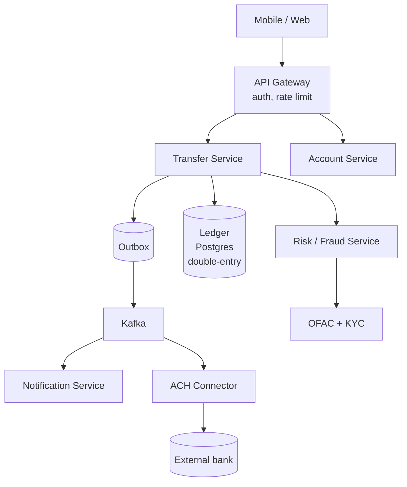
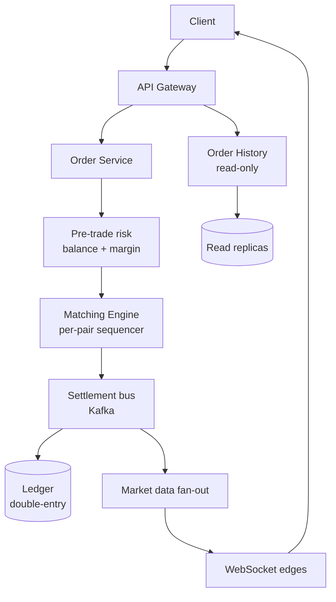
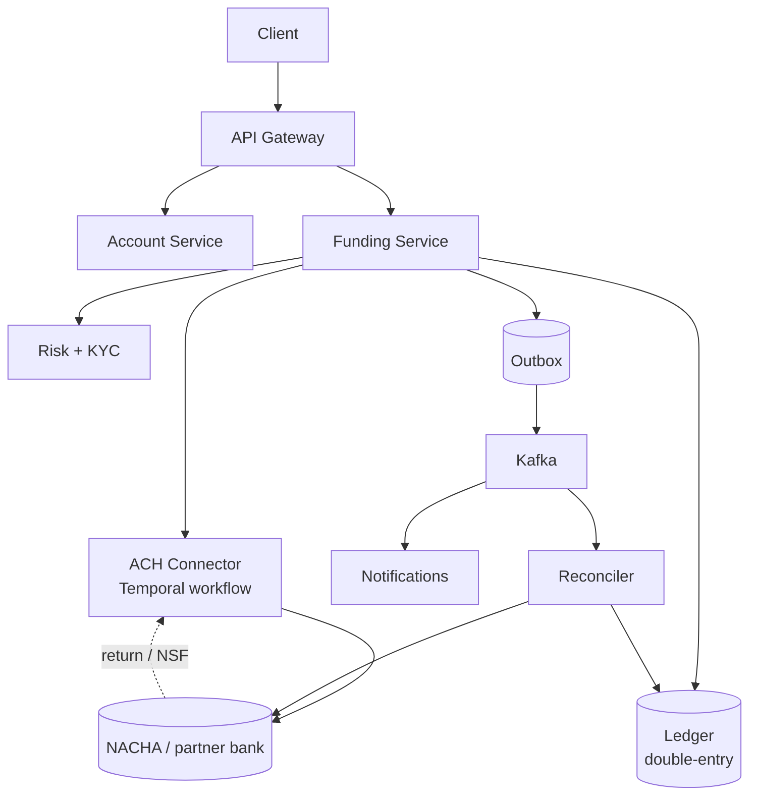

# Coinbase System Design: Interview Execution Playbook

The prompt: *"Design a zero-to-one system based on a real-life scenario, demonstrating technical expertise and justifying decisions against potential challenges, while showcasing thoroughness in both depth and breadth of the system design."*

This file is **delivery mechanics**, not architecture knowledge. Reread it the morning of. Patterns and Coinbase-specific facts live in [crash-course.md](crash-course.md).

**What the prompt is actually testing:**
- **Zero-to-one** → can you structure ambiguity from a blank slate? Drive scope, don't wait for it.
- **Real-life scenario** → expect something you'd know as a *user*, not Coinbase-internal exotica. Coinbase's published hint: *"if you know the basics of an online brokerage, you're about as ready as you can be."*
- **Depth AND breadth** → both. Can't just go deep on one box, can't just hand-wave the architecture.
- **Justifying decisions against challenges** → they will probe. Lead every decision with the rejected alternative.

---

## The First 5 Minutes Decide the Round

Before drawing anything, drive these three:

### 1. Functional scope (what's in the MVP)

Ask:
- "Who's the user? Retail consumer? Institutional?"
- "What's the core flow you want me to focus on — the happy path?"
- "What's explicitly out of scope?"

Then **commit a scope out loud**: *"I'll design for X and Y; I'll mention Z but not draw it. Push back if that's the wrong cut."* Staff signal: you drove the scope, didn't beg for it.

### 2. Scale and shape

Ask (or assume and announce):
- "Roughly how many users? DAU/MAU?"
- "What's the read:write ratio?"
- "Is this latency-sensitive or throughput-sensitive?"
- "Any 10x spike pattern I should design for?"

Don't burn time on Fermi math. **One number per axis** is enough: "I'll assume 10M DAU, 100:1 read:write, p99 < 200ms on the hot path, 10x spike on market events." Then move on.

### 3. Non-functional priorities (rank them out loud)

For any Coinbase-flavored problem: **correctness > durability > availability > latency > cost**. Say it explicitly. *"Money paths fail closed, read paths fail open. Audit immutability is non-negotiable."* This is the framing line that signals "I get the domain."

---

## Time Budget (60-min slot)

| Minutes | Phase                              | Output                                                                 |
| ------- | ---------------------------------- | ---------------------------------------------------------------------- |
| **0–5** | Requirements, scope, scale         | One paragraph of constraints written on the board                      |
| **5–10**| API surface + core data model       | 3–5 endpoints, the 2–3 core tables                                     |
| **10–25**| High-level architecture (breadth) | Boxes-and-arrows diagram covering the full flow end-to-end              |
| **25–50**| Deep dive (depth)                 | 1–2 components opened up: schema, concurrency, failure modes            |
| **50–60**| Wrap                              | Failure modes, scaling story, what you'd do next                       |

**75-min slot:** add 5 min to breadth (10–30) and 10 min to depth (30–60). **90-min slot:** expect a second deep-dive request.

If they cut you off at 25 min while you're still in breadth, you over-scoped. **Watch their face.** When they look ready to redirect, finish your sentence and ask *"Is there a part you'd like me to go deeper on, or shall I pick?"*

---

## The T-Shape Announcement

When you finish breadth and start depth, **say this out loud**:

> *"That's the breadth pass. Three things I think are worth going deep on: (a) the ledger and idempotency story, (b) how the deposit pipeline handles reorgs, (c) the failure-and-recovery story for the signing path. I'd start with (a) since it's the highest-stakes and the rest depend on it. Push back if you'd rather see one of the others first."*

Why this works:
- Shows you can rank by importance (staff signal)
- Gives the interviewer steering authority without forcing them to interrupt
- Pre-commits you to depth on the *most stakes-heavy* component, which is the Coinbase-correct call

---

## Driving the Conversation (Not Riding It)

**Lead every decision with the rejected alternative.** This is Coinbase's #ExplicitTradeoffs principle and it's the single biggest staff differentiator.

Pattern: *"I'm choosing X over Y because Z. The cost is W. I'd mitigate W by V."*

Examples:
- *"Postgres over DynamoDB because the ledger needs multi-row transactions across debit and credit. Cost: single-node write ceiling around 10K/sec. Mitigated by sharding on `user_id`."*
- *"Synchronous reconciliation over async because financial drift can't be eventually consistent. Cost: 50ms added to the critical path. Mitigated by reconciling against a hot replica."*
- *"Temporal over a state-column-plus-cron because crash-resume on multi-step async is a primitive, not something I want to build. Cost: ops overhead and per-action pricing. Worth it for the withdrawal pipeline; overkill for a single API call."*

**When pushed back on:** *"That's a fair point — let me think about it"* (3-second pause, actually think) → *"Yeah, you're right that X breaks under Y. I'd revise to Z because…"*

Coinbase explicitly says: *"Being wrong with confidence is a negative signal; humility is a positive signal."* Don't dig in.

---

## CodeSignal Whiteboard Mechanics

CodeSignal's whiteboard is rougher than Excalidraw. Plan accordingly.

- **Pre-build a layout in your head:** clients top, edge/API middle-top, services middle, data stores bottom. Always.
- **Boxes have labels, arrows have labels.** An unlabeled arrow is dead weight.
- **Number sequence steps on arrows** when you walk a flow ("1. POST /transfer, 2. validate, 3. write outbox").
- **Don't try to be pretty.** Legibility > aesthetics.
- **Keep one whiteboard per component on deep-dive.** Don't jam schema, sequence, and architecture on one canvas.
- **Practice the tool before the interview.** 30 minutes the day before is enough.

---

## Failure-Mode Probes to Anticipate

Coinbase will ask at least 3 of these. Pre-load answers:

| Probe                                                  | Answer shape                                                                       |
| ------------------------------------------------------ | ---------------------------------------------------------------------------------- |
| *"What if the database goes down mid-write?"*          | Idempotency key + outbox + retry. Walk the state machine forward, never rollback. |
| *"What if a retry hits a different replica/backend?"*  | Per-backend namespacing on idempotency keys; check status before failover.        |
| *"What if a chain reorgs?"*                            | Tentative vs. finalized states; reverse tentative credits, never finalized.       |
| *"What if traffic 10x's during a market event?"*       | Predictive pre-warm 30–60 min ahead; circuit breakers for the unforecasted tail.   |
| *"How do you know the ledger is correct?"*             | Continuous reconciliation against external sources; financial drift never auto-corrects, pages on-call. |
| *"What if a malicious insider tries to move funds?"*   | No single human can move funds. Quorum approvers + cooling-off + audit trail.     |
| *"What's your blast radius if cache X fails?"*         | Fail-open for reads (degraded UX), fail-closed for money paths (halt withdrawals).|
| *"Walk me through the worst incident this could cause."* | Pick the actual worst (double-credit, lost funds, missed sanction). Show how the architecture prevents it. |

---

## Recovery Moves When You're Stuck

- **Stuck on a tradeoff?** *"Both work. The tiebreaker is X. I'd pick Y on a Coinbase-style problem because Z."*
- **Realizing your design has a flaw?** *"Wait — I missed something. If [scenario], my current design would [break]. Let me revise."* This is a positive signal, not negative. Catching your own mistakes mid-flight beats defending them.
- **Out of time on depth?** *"I'd want to keep going on this, but in the time left, let me hit the failure modes and what I'd build next."*
- **They asked something you don't know?** *"I haven't worked with X directly. The shape I'd reach for is Y because [pattern]. Happy to be corrected on the specifics."* Never bluff.

---

## Closing Checklist (Last 5 Minutes)

Hit each in one sentence:

1. **Failure modes:** "Worst case is X; mitigated by Y."
2. **Scale story:** "First bottleneck I'd hit is X around Y QPS; I'd address by Z."
3. **What I'd build next:** "Out of scope today but I'd add A and B before launch."
4. **What I'd monitor:** "Top 3 alerts: ledger reconciliation drift, withdrawal pipeline latency, hot-tier capacity."

If they cut you off, that's fine. The point is to show you have these top of mind.

---

## Behavioral Signal During the Round

Coinbase rounds explicitly score on cultural tenets. Things to *do*:

- **Show ownership:** mention cost, on-call burden, observability, blast radius unprompted.
- **Be #SecurityFirst-flavored:** put auth, audit, custody in the *first* diagram, not bolted on.
- **Take pushback well:** lean in, don't defend.
- **Name the rejected alternative:** every choice, every time.

Things to *not do*:

- Don't say "obviously" or "trivially." Nothing in distributed systems is.
- Don't claim experience you don't have. Bar raisers cross-check.
- Don't go silent for >20 seconds. Narrate: *"I'm thinking about whether X or Y…"*

---

# Practice Prompts (Worked Openings)

Three "real-life scenarios" likely for Consumer-Retail Cash. For each: clarifying questions, scope commitment, breadth sketch, deep-dive candidates, tradeoffs to surface.

The point of these worked openings is **rehearsal for the first 15 minutes** — the part where most candidates either nail it or never recover.

---

## Prompt 1: Design a Peer-to-Peer Money Transfer System (Venmo / Cash App)

Most likely prompt. Tests ledger, idempotency, fraud, notifications, KYC.

### Clarifying questions
1. "Are we sending fiat balances between users on the same platform, or also out to bank accounts?"
2. "Public social feed (Venmo) or private (Zelle)?"
3. "What scale — 10M users, 100M? Peak TPS?"
4. "Is funding source in-scope (ACH pull, debit card, balance) or do we assume a balance exists?"
5. "Cross-border or single-currency?"

### Scope commitment to make
> *"I'll design for in-platform fiat transfers between balances, plus ACH out, US-only, single currency. 50M users, ~100 TPS steady, 1000 TPS spike. I'll mention notifications and the social feed but not draw them. Push back if that's the wrong cut."*

### Breadth sketch

### Deep-dive candidates (rank these out loud)
1. **Ledger and idempotency** — highest stakes; everything else depends on it
2. **ACH out path** — interesting because of irreversibility, returns, NSF (non-sufficient funds), bank settlement windows
3. **Fraud / risk gating** — where the round most often probes "what if a stolen account…"

Lead with #1. Be ready to pivot to #2 if they steer there (likely for Retail-Cash).

### Tradeoffs to surface explicitly
- **Postgres ledger over Dynamo:** multi-row transactions for debit + credit
- **Synchronous risk check over async:** money path is fail-closed
- **ACH out as async workflow (Temporal) over sync API:** ACH settles in T+1–3, can be returned up to 60 days for consumer; needs durable state
- **Idempotency key from client `(user_id, intent_id)`:** retries are safe; client controls the dedup window

### Probes to expect
- *"What happens if the user double-taps the send button?"* → idempotency key dedup
- *"What if the recipient's account is frozen?"* → state machine has a `RECIPIENT_REJECTED` terminal; sender's debit reverses
- *"What about ACH returns 5 days later?"* → async event reverses the credit; user balance can go negative; collections flow

---

## Prompt 2: Design an Online Brokerage (Robinhood-Style)

Coinbase's published hint specifically names this. Tests order routing, balance checks, market data, settlement.

### Clarifying questions
1. "Equities, crypto, or both? Options/derivatives in scope?"
2. "Market hours only, or 24/7? (Crypto is 24/7, equities aren't.)"
3. "Self-clearing or do we route to a broker-dealer?"
4. "Real-time price feed in scope, or assume a price service exists?"
5. "What scale — DAU and peak orders/sec?"

### Scope commitment to make
> *"I'll design for crypto spot trading, 24/7, self-clearing on our own matching engine, assuming a price service exists. 5M DAU, 1K orders/sec steady, 50K spike during BTC pumps. I'll cover the order lifecycle and the matching/settlement seam, but not draw the matching engine internals."*

### Breadth sketch

### Deep-dive candidates
1. **Order lifecycle state machine** — `RECEIVED → RISK_PASSED → SUBMITTED → PARTIALLY_FILLED → FILLED / CANCELLED / REJECTED`
2. **Pre-trade risk and balance reservation** — how you avoid double-spend across concurrent orders without serializing on a hot row
3. **Settlement seam** — how matched fills become double-entry journal entries idempotently

Lead with #2 — it's the most interesting concurrency problem and most candidates miss it.

### Tradeoffs to surface
- **Reserve balance at order placement (pessimistic) over check-at-fill (optimistic):** prevents double-spend at the cost of locking up funds during open orders
- **Per-pair sequencer (single-threaded matching) over multi-threaded:** deterministic replay from WAL
- **Two-path architecture (hot loop vs. fan-out):** state this in the first sentence
- **Circuit breakers halt trading on >10% moves in 5 min:** consistency wins over availability

### Probes to expect
- *"What if a user places an order, then withdraws their balance before the fill?"* → balance reserved at order placement, not at fill
- *"What if the matching engine crashes mid-fill?"* → WAL replay; RAFT-replicated state machine; deterministic recovery
- *"What if the fill event is processed twice by the ledger?"* → idempotency key `(matching_engine, fill_id)`; UNIQUE constraint on entries table

---

## Prompt 3: Design a Cash Account with Bank Deposits/Withdrawals (Closest to Retail-Cash)

Less famous but most directly aligned to your role. Tests ACH integration, balance management, the bank↔internal seam.

### Clarifying questions
1. "Is the cash balance interest-bearing? (Affects accrual and accounting.)"
2. "ACH only, or wires + debit card top-up too?"
3. "Single currency / single jurisdiction (US)?"
4. "What's the user's primary action — fund the account, or also send/spend from it?"
5. "Peak deposit volume during what kind of event?"

### Scope commitment to make
> *"I'll design for a non-interest-bearing cash balance, US-only, with ACH in (instant credit on a delay-revocable basis), ACH out, and balance read. I'll mention interest accrual and the spend rail but not draw them. 10M users, mostly batch-shaped daily deposit traffic with a 5x spike around payday."*

### Breadth sketch

### Deep-dive candidates
1. **ACH lifecycle and the "instant credit, eventual settlement" model** — most interesting because of ACH returns up to 60 days
2. **Reconciliation between internal ledger and partner bank statements** — daily batch + alert on drift
3. **Idempotency from the user's deposit intent through to NACHA file submission**

Lead with #1 — it's where the interesting domain shapes are.

### Tradeoffs to surface
- **Instant credit vs. settled credit:** consumer expectation is instant; risk is the return window. Hold a "tentative" balance separate from "settled" — fund-availability gates use settled, display uses tentative.
- **Temporal workflow over status-column-plus-cron for ACH lifecycle:** durable across crashes, visible workflow IDs, easier debugging of stuck deposits
- **Daily batch reconciliation against partner bank over real-time:** ACH itself is batch-shaped, real-time recon would diff against in-flight state and false-alarm
- **KYC tier gates fund availability ceiling, not just existence:** Tier 1 might allow $500/day, Tier 2 $5K/day

### Probes to expect
- *"What happens when an ACH deposit is returned 5 days later?"* → reverse the credit; if balance is now negative, collections flow + account hold
- *"Two deposits arrive for the same `(user, transaction_id)` from a retry — what happens?"* → idempotency key; second one is a no-op
- *"How do you know your ledger matches the bank?"* → daily recon job diffs both sides, alerts on drift > $0.01, never auto-corrects ledger

---

## How to Rehearse These

**Don't memorize the worked openings.** The whole point of zero-to-one is they'll hand you something *adjacent* to these but not identical. Rehearse the **moves**:

1. Read the prompt → ask 3–5 clarifying questions in 60 seconds
2. Commit a scope out loud
3. Sketch breadth in 10 minutes
4. Announce 2–3 depth candidates and rank them
5. Go deep on one with explicit tradeoffs
6. Hit the failure-mode probes

If you can do that on a 30-second prompt you've never seen, you're ready. Drill on prompts adjacent to these (e.g., "design a recurring buy / DCA service," "design a notification system for transaction events," "design bill pay") to stretch the muscle.
