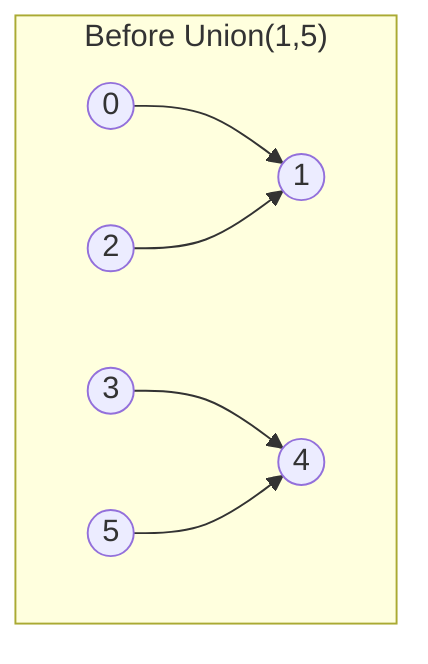
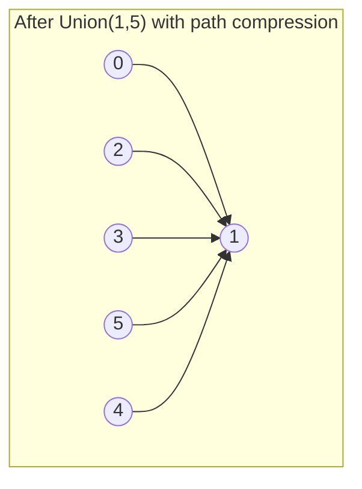
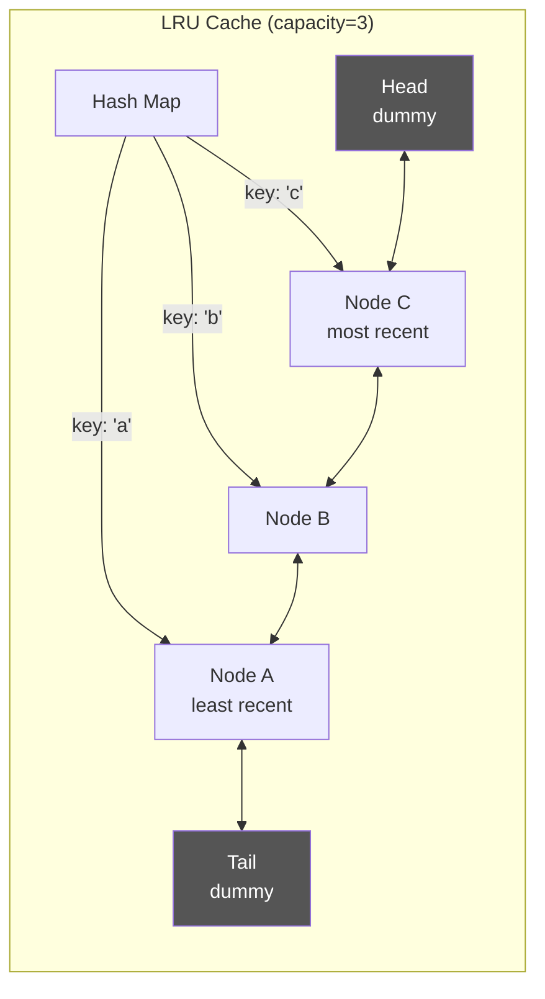
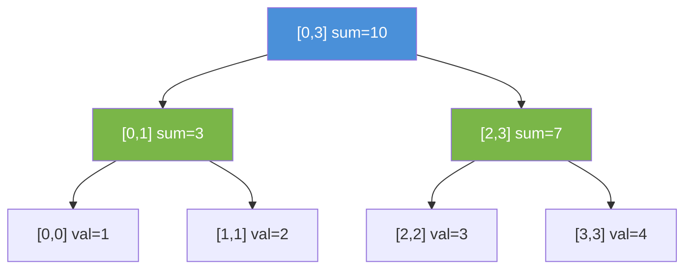
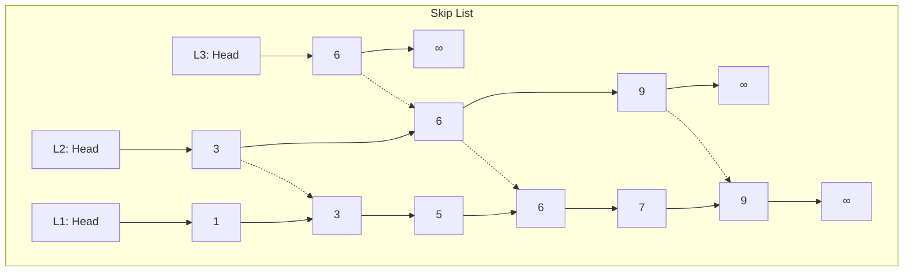
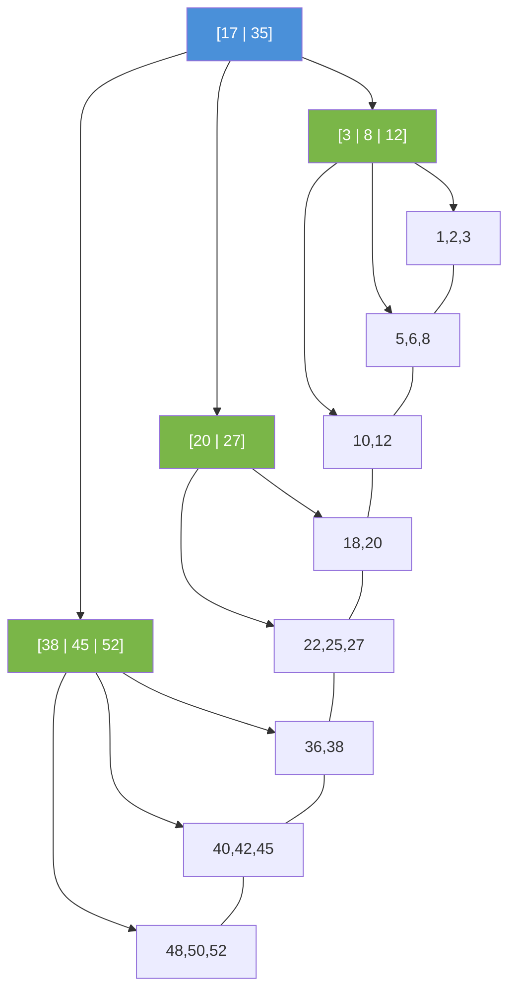

# Advanced Data Structures

The basic toolkit (arrays, hash maps, trees, heaps) handles 80% of interview problems. The remaining 20% — and most staff-level differentiators — require specialized structures. You won't implement a segment tree from scratch in a 45-minute round, but you need to know when one is the right tool and be able to sketch the approach. More importantly, structures like Union-Find, monotonic stacks, and LRU caches show up directly as interview problems. Knowing these cold signals depth.

---

## Union-Find (Disjoint Set Union)

Union-Find tracks a collection of disjoint sets and supports two operations: **find** (which set does this element belong to?) and **union** (merge two sets). With path compression and union by rank, both operations run in nearly O(1) amortized — technically O(α(n)) where α is the inverse Ackermann function, which is effectively constant for any practical input.

This is the go-to structure for connected components, cycle detection in undirected graphs, and Kruskal's MST algorithm.





```ruby
class UnionFind
  def initialize(n)
    @parent = (0...n).to_a
    @rank = Array.new(n, 0)
    @count = n  # number of connected components
  end

  attr_reader :count

  def find(x)
    @parent[x] = find(@parent[x]) while @parent[x] != x
    # Iterative path compression — flattens the tree
    root = x
    root = @parent[root] until @parent[root] == root
    while @parent[x] != root
      @parent[x], x = root, @parent[x]
    end
    root
  end

  def union(x, y)
    rx, ry = find(x), find(y)
    return false if rx == ry

    # Union by rank — attach shorter tree under taller
    rx, ry = ry, rx if @rank[rx] < @rank[ry]
    @parent[ry] = rx
    @rank[rx] += 1 if @rank[rx] == @rank[ry]
    @count -= 1
    true
  end

  def connected?(x, y)
    find(x) == find(y)
  end
end
```

**Interview problems:** Number of Islands (alternative to DFS), Redundant Connection (cycle detection), Accounts Merge, Earliest Moment When Everyone Becomes Friends, Number of Provinces.

---

## Monotonic Stack

A monotonic stack maintains elements in strictly increasing or decreasing order. When a new element violates the ordering, you pop until the invariant is restored. This gives you O(n) solutions to problems that naively require O(n^2) — specifically "next greater/smaller element" patterns.

The key insight: each element is pushed and popped at most once, so despite the inner while loop, total work is O(n).

```ruby
# Next Greater Element: for each element, find the first larger element to its right
def next_greater_elements(nums)
  n = nums.length
  result = Array.new(n, -1)
  stack = []  # stores indices, monotonically decreasing values

  (0...n).each do |i|
    while !stack.empty? && nums[stack.last] < nums[i]
      result[stack.pop] = nums[i]
    end
    stack.push(i)
  end
  result
end

# Largest Rectangle in Histogram — classic monotonic stack problem
def largest_rectangle_area(heights)
  stack = []  # indices of increasing heights
  max_area = 0

  (0..heights.length).each do |i|
    h = i == heights.length ? 0 : heights[i]
    while !stack.empty? && heights[stack.last] > h
      height = heights[stack.pop]
      width = stack.empty? ? i : i - stack.last - 1
      max_area = [max_area, height * width].max
    end
    stack.push(i)
  end
  max_area
end
```

**Monotonic Queue** extends this pattern for sliding window problems. Use a deque where the front always holds the current window's max/min.

```ruby
# Sliding Window Maximum — O(n) with monotonic deque
def max_sliding_window(nums, k)
  deque = []  # stores indices, values are monotonically decreasing
  result = []

  nums.each_with_index do |num, i|
    # Remove elements outside the window
    deque.shift if !deque.empty? && deque.first <= i - k
    # Maintain decreasing order
    deque.pop while !deque.empty? && nums[deque.last] <= num
    deque.push(i)
    result << nums[deque.first] if i >= k - 1
  end
  result
end
```

**Interview problems:** Daily Temperatures, Trapping Rain Water, Sliding Window Maximum, Stock Span, Sum of Subarray Minimums.

---

## LRU Cache

The most classic design-style data structure problem. An LRU (Least Recently Used) cache combines a hash map for O(1) lookups with a doubly-linked list for O(1) insertion/deletion and ordering. Every `get` and `put` runs in O(1).



```ruby
class LRUCache
  Node = Struct.new(:key, :val, :prev, :next)

  def initialize(capacity)
    @cap = capacity
    @map = {}
    @head = Node.new  # dummy head (most recent side)
    @tail = Node.new  # dummy tail (least recent side)
    @head.next = @tail
    @tail.prev = @head
  end

  def get(key)
    return -1 unless @map.key?(key)
    node = @map[key]
    move_to_front(node)
    node.val
  end

  def put(key, value)
    if @map.key?(key)
      node = @map[key]
      node.val = value
      move_to_front(node)
    else
      evict if @map.size >= @cap
      node = Node.new(key, value)
      @map[key] = node
      add_to_front(node)
    end
  end

  private

  def add_to_front(node)
    node.next = @head.next
    node.prev = @head
    @head.next.prev = node
    @head.next = node
  end

  def remove(node)
    node.prev.next = node.next
    node.next.prev = node.prev
  end

  def move_to_front(node)
    remove(node)
    add_to_front(node)
  end

  def evict
    lru = @tail.prev
    remove(lru)
    @map.delete(lru.key)
  end
end
```

**Interview tip:** Interviewers love follow-ups: "What if this needs to be thread-safe?" (add a mutex around get/put), "What about TTL-based expiration?" (add timestamps, lazy eviction on access or background sweep), "LFU instead?" (add frequency counter + min-frequency tracking).

---

## Segment Tree

Segment trees answer range queries (sum, min, max) and handle point/range updates in O(log n). If an interviewer gives you a problem with repeated range queries on a mutable array, segment tree is likely the answer.



```ruby
class SegmentTree
  def initialize(arr)
    @n = arr.length
    @tree = Array.new(4 * @n, 0)
    build(arr, 1, 0, @n - 1)
  end

  def update(idx, val, node = 1, lo = 0, hi = @n - 1)
    if lo == hi
      @tree[node] = val
      return
    end
    mid = (lo + hi) / 2
    if idx <= mid
      update(idx, val, 2 * node, lo, mid)
    else
      update(idx, val, 2 * node + 1, mid + 1, hi)
    end
    @tree[node] = @tree[2 * node] + @tree[2 * node + 1]
  end

  def query(ql, qr, node = 1, lo = 0, hi = @n - 1)
    return 0 if ql > hi || qr < lo          # no overlap
    return @tree[node] if ql <= lo && hi <= qr  # total overlap
    mid = (lo + hi) / 2
    query(ql, qr, 2 * node, lo, mid) + query(ql, qr, 2 * node + 1, mid + 1, hi)
  end

  private

  def build(arr, node, lo, hi)
    if lo == hi
      @tree[node] = arr[lo]
      return
    end
    mid = (lo + hi) / 2
    build(arr, 2 * node, lo, mid)
    build(arr, 2 * node + 1, mid + 1, hi)
    @tree[node] = @tree[2 * node] + @tree[2 * node + 1]
  end
end
```

**When to use Segment Tree vs Fenwick Tree:** Fenwick trees (BIT) are simpler and use less memory, but only handle prefix-based operations. Segment trees are more flexible — they support arbitrary range queries, lazy propagation for range updates, and can be adapted for min/max queries. If the problem is just prefix sums with point updates, use Fenwick. Otherwise, segment tree.

---

## Fenwick Tree (Binary Indexed Tree)

A Fenwick tree supports prefix sum queries and point updates in O(log n) with minimal code. It exploits the binary representation of indices — each index is responsible for a range determined by its lowest set bit.

```ruby
class FenwickTree
  def initialize(n)
    @n = n
    @tree = Array.new(n + 1, 0)  # 1-indexed
  end

  def update(i, delta)
    i += 1  # convert to 1-indexed
    while i <= @n
      @tree[i] += delta
      i += i & (-i)  # add lowest set bit
    end
  end

  def prefix_sum(i)
    i += 1  # convert to 1-indexed
    sum = 0
    while i > 0
      sum += @tree[i]
      i -= i & (-i)  # remove lowest set bit
    end
    sum
  end

  def range_sum(l, r)
    l.zero? ? prefix_sum(r) : prefix_sum(r) - prefix_sum(l - 1)
  end
end
```

**Interview problems:** Count of Smaller Numbers After Self, Range Sum Query (Mutable), Count Inversions.

---

## Bloom Filter

A Bloom filter is a space-efficient probabilistic data structure that tests whether an element is a member of a set. It can produce false positives ("maybe in set") but never false negatives ("definitely not in set"). Uses k hash functions mapping to a bit array of size m.

**False positive rate:** approximately (1 - e^(-kn/m))^k where n is the number of inserted elements.

```ruby
require 'digest'

class BloomFilter
  def initialize(size, num_hashes)
    @size = size
    @num_hashes = num_hashes
    @bits = Array.new(size, false)
  end

  def add(item)
    hash_indices(item).each { |i| @bits[i] = true }
  end

  def possibly_contains?(item)
    hash_indices(item).all? { |i| @bits[i] }
  end

  private

  def hash_indices(item)
    (0...@num_hashes).map do |i|
      Digest::MD5.hexdigest("#{i}:#{item}").to_i(16) % @size
    end
  end
end
```

**Production uses:** Cassandra uses Bloom filters to avoid unnecessary disk reads. Chrome used one for malicious URL detection. Redis has built-in Bloom filter support via RedisBloom. Any "check before expensive lookup" scenario is a candidate.

**Interview context:** Bloom filters rarely appear as standalone coding problems but come up heavily in system design rounds. Know the trade-offs and be ready to suggest one when designing a system with expensive membership checks.

---

## Skip List

A skip list is a probabilistic alternative to balanced BSTs. It maintains multiple layers of linked lists where each higher layer skips over more elements, giving O(log n) expected search, insert, and delete. Redis uses skip lists for its sorted set implementation.



**Why skip lists over balanced BSTs?** Simpler to implement, easier to reason about concurrently (no rotations), and range queries are trivial (just walk the bottom level). The trade-off is higher memory usage (average 2x pointers per node) and probabilistic rather than guaranteed O(log n).

**Interview context:** Skip lists are more of a system design discussion point than a coding problem. Know why Redis chose them over red-black trees (simplicity, concurrent access, range queries) and be ready to compare them.

---

## B-Trees / B+ Trees

B-trees are self-balancing search trees designed for disk-based storage. Each node holds multiple keys and has a high branching factor, minimizing disk I/O. B+ trees (the variant used in virtually all databases) store all values in leaf nodes, with internal nodes serving only as an index.



**Key properties:** A B-tree of order m has at most m children per node, at least ⌈m/2⌉ children (except root), and all leaves at the same depth. B+ trees add leaf-level linked list for efficient range scans — this is why `SELECT * WHERE id BETWEEN 100 AND 200` is fast in PostgreSQL.

**Interview context:** You won't implement a B-tree in a coding round. But in system design, you should know: why databases use B+ trees (disk I/O optimization, sequential access for range queries), how index lookups work (O(log_m n) disk reads), and when an index helps vs hurts (write amplification, space overhead).

---

## Complexity Cheat Sheet

| Structure | Search | Insert | Delete | Space | Notes |
|---|---|---|---|---|---|
| Union-Find | O(α(n)) | O(α(n)) | — | O(n) | α(n) ≈ O(1) in practice |
| Monotonic Stack | — | O(1) amort | O(1) amort | O(n) | Each element pushed/popped once |
| LRU Cache | O(1) | O(1) | O(1) | O(n) | Hash map + doubly linked list |
| Segment Tree | O(log n) query | O(log n) update | — | O(4n) | Range queries, point/range updates |
| Fenwick Tree | O(log n) prefix | O(log n) update | — | O(n) | Simpler than segment tree |
| Bloom Filter | O(k) | O(k) | — | O(m) bits | Probabilistic, no false negatives |
| Skip List | O(log n) exp | O(log n) exp | O(log n) exp | O(n) avg | Probabilistic balancing |
| B-Tree | O(log n) | O(log n) | O(log n) | O(n) | Optimized for disk I/O |

---

## Study Strategy

1. **Must-know for coding rounds:** Union-Find, Monotonic Stack/Queue, LRU Cache. These appear directly as interview problems. Implement each from memory.
2. **Must-know conceptually:** Segment Tree, Fenwick Tree, Bloom Filter. You should recognize when a problem calls for them and sketch the approach, even if you don't have every line memorized.
3. **System design ammo:** Skip Lists, B-Trees, Bloom Filters. These demonstrate depth in design discussions. Know the "why" behind each — what problem they solve that simpler structures don't.
4. **Practice pattern:** For each structure, solve 2-3 LeetCode problems. Focus on Union-Find and Monotonic Stack — they appear most often.

---

## Related Topics

- [[../01-data-structures-and-algorithms/index|Data Structures & Algorithms]] — foundational structures this builds on
- [[../09-dynamic-programming/index|Dynamic Programming]] — segment trees often optimize DP range queries
- [[../../system-design/01-databases-and-storage/index|Databases & Storage]] — B-trees, Bloom filters in production systems
