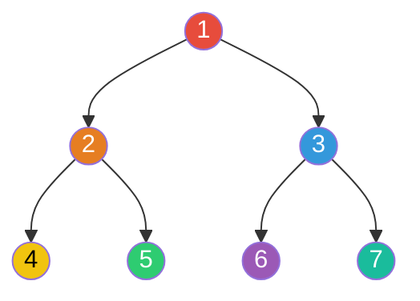
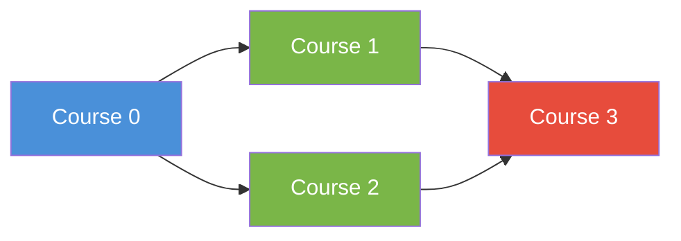
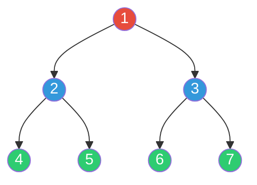
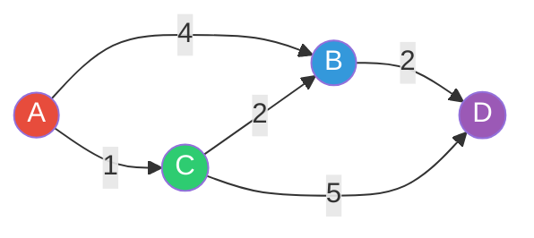

# Search Algorithms

Search algorithms are the backbone of graph and array problems in interviews. At the staff level, interviewers don't just want you to run a BFS — they want you to explain why BFS over DFS, discuss the trade-offs, and know when Dijkstra's breaks down. The difference between a senior and staff answer is recognizing that "shortest path" doesn't automatically mean Dijkstra's — it might mean BFS (unweighted), Bellman-Ford (negative weights), or even binary search on the answer space.

This guide covers every search algorithm you'll encounter in interviews, from binary search variations through weighted graph traversals.

---

## Binary Search

Binary search is deceptively deep. The basic version is trivial, but the variations — search on rotated arrays, bisect left/right, binary search on answer space — are where interviews get interesting. The core invariant: maintain a search space where the answer must exist, and halve it each step.

### Standard Binary Search

```ruby
def binary_search(nums, target)
  lo, hi = 0, nums.length - 1
  while lo <= hi
    mid = lo + (hi - lo) / 2  # avoid overflow (matters in other languages)
    if nums[mid] == target
      return mid
    elsif nums[mid] < target
      lo = mid + 1
    else
      hi = mid - 1
    end
  end
  -1
end
```

### Bisect Left / Bisect Right

These find the insertion point — the first position where you could insert the target and maintain sorted order. Bisect left gives the leftmost match, bisect right gives one past the rightmost match.

```ruby
# Find the first index where nums[i] >= target
def bisect_left(nums, target)
  lo, hi = 0, nums.length
  while lo < hi
    mid = lo + (hi - lo) / 2
    if nums[mid] < target
      lo = mid + 1
    else
      hi = mid
    end
  end
  lo
end

# Find the first index where nums[i] > target
def bisect_right(nums, target)
  lo, hi = 0, nums.length
  while lo < hi
    mid = lo + (hi - lo) / 2
    if nums[mid] <= target
      lo = mid + 1
    else
      hi = mid
    end
  end
  lo
end
```

**Counting occurrences in sorted array:** `bisect_right(nums, target) - bisect_left(nums, target)`.

### Search on Rotated Sorted Array

The trick: at least one half of the array around `mid` is always sorted. Determine which half is sorted, then check if the target falls within that sorted half.

```ruby
def search_rotated(nums, target)
  lo, hi = 0, nums.length - 1
  while lo <= hi
    mid = lo + (hi - lo) / 2
    return mid if nums[mid] == target

    if nums[lo] <= nums[mid]
      # Left half is sorted
      if nums[lo] <= target && target < nums[mid]
        hi = mid - 1
      else
        lo = mid + 1
      end
    else
      # Right half is sorted
      if nums[mid] < target && target <= nums[hi]
        lo = mid + 1
      else
        hi = mid - 1
      end
    end
  end
  -1
end
```

### Binary Search on Answer Space

One of the most powerful patterns: instead of searching through the input, binary search on the possible answer values. Works when you can frame the problem as "is answer X feasible?" and feasibility is monotonic.

```ruby
# Koko Eating Bananas: minimum eating speed to finish within h hours
def min_eating_speed(piles, h)
  lo, hi = 1, piles.max

  while lo < hi
    mid = lo + (hi - lo) / 2
    hours_needed = piles.sum { |p| (p.to_f / mid).ceil }
    if hours_needed <= h
      hi = mid      # feasible — try smaller speed
    else
      lo = mid + 1  # too slow — need faster
    end
  end
  lo
end

# Split Array Largest Sum: minimize the largest sum among k subarrays
def split_array(nums, k)
  lo, hi = nums.max, nums.sum

  while lo < hi
    mid = lo + (hi - lo) / 2
    if can_split?(nums, k, mid)
      hi = mid
    else
      lo = mid + 1
    end
  end
  lo
end

def can_split?(nums, k, max_sum)
  count, current = 1, 0
  nums.each do |n|
    if current + n > max_sum
      count += 1
      current = n
    else
      current += n
    end
  end
  count <= k
end
```

**Interview problems:** Search in Rotated Sorted Array, Find Minimum in Rotated Sorted Array, Koko Eating Bananas, Capacity to Ship Packages, Median of Two Sorted Arrays.

---

## Depth-First Search (DFS)

DFS explores as deep as possible before backtracking. It's the natural choice for: exhaustive search, path finding, cycle detection, topological sorting, and any problem that asks "does a path/configuration exist?"

### Recursive vs Iterative



**DFS visit order: 1 → 2 → 4 → 5 → 3 → 6 → 7** (goes deep before wide)

```ruby
# Recursive DFS on a graph (adjacency list)
def dfs_recursive(graph, node, visited = Set.new)
  return if visited.include?(node)
  visited.add(node)
  # Process node here
  graph[node].each { |neighbor| dfs_recursive(graph, neighbor, visited) }
end

# Iterative DFS — use when recursion depth might overflow the stack
def dfs_iterative(graph, start)
  visited = Set.new
  stack = [start]

  until stack.empty?
    node = stack.pop
    next if visited.include?(node)
    visited.add(node)
    # Process node here
    graph[node].each { |neighbor| stack.push(neighbor) }
  end
end
```

### Tree Traversals

```ruby
# Pre-order: root, left, right (used for serialization)
def preorder(root)
  return [] unless root
  [root.val] + preorder(root.left) + preorder(root.right)
end

# In-order: left, root, right (gives sorted order for BST)
def inorder(root)
  return [] unless root
  inorder(root.left) + [root.val] + inorder(root.right)
end

# Post-order: left, right, root (used for deletion, expression evaluation)
def postorder(root)
  return [] unless root
  postorder(root.left) + postorder(root.right) + [root.val]
end
```

### Cycle Detection

Different approaches for directed vs undirected graphs:

```ruby
# Directed graph: cycle exists if we revisit a node in the current DFS path
def has_cycle_directed?(graph, n)
  visited = Array.new(n, :unvisited)  # :unvisited, :in_progress, :done

  dfs = lambda do |node|
    return true if visited[node] == :in_progress  # back edge = cycle
    return false if visited[node] == :done

    visited[node] = :in_progress
    graph[node].each { |neighbor| return true if dfs.call(neighbor) }
    visited[node] = :done
    false
  end

  (0...n).any? { |i| dfs.call(i) }
end

# Undirected graph: cycle exists if we visit a node that isn't our parent
def has_cycle_undirected?(graph, n)
  visited = Array.new(n, false)

  dfs = lambda do |node, parent|
    visited[node] = true
    graph[node].each do |neighbor|
      next if neighbor == parent
      return true if visited[neighbor]
      return true if dfs.call(neighbor, node)
    end
    false
  end

  (0...n).any? { |i| !visited[i] && dfs.call(i, -1) }
end
```

### Topological Sort

Orders vertices in a DAG so that for every edge u→v, u appears before v. Two approaches:



**Topological order: 0 → 1 → 2 → 3** (or 0 → 2 → 1 → 3)

```ruby
# Kahn's Algorithm (BFS-based) — preferred when you need to detect if a valid ordering exists
def topological_sort_kahn(graph, n)
  in_degree = Array.new(n, 0)
  graph.each { |_u, neighbors| neighbors.each { |v| in_degree[v] += 1 } }

  queue = (0...n).select { |i| in_degree[i] == 0 }
  order = []

  until queue.empty?
    node = queue.shift
    order << node
    graph[node].each do |neighbor|
      in_degree[neighbor] -= 1
      queue << neighbor if in_degree[neighbor] == 0
    end
  end

  order.length == n ? order : []  # empty = cycle exists
end

# DFS-based topological sort
def topological_sort_dfs(graph, n)
  visited = Array.new(n, false)
  stack = []

  dfs = lambda do |node|
    visited[node] = true
    graph[node].each { |neighbor| dfs.call(neighbor) unless visited[neighbor] }
    stack.push(node)  # add to stack after all descendants are processed
  end

  (0...n).each { |i| dfs.call(i) unless visited[i] }
  stack.reverse
end
```

**Interview problems:** Number of Islands, Clone Graph, Course Schedule I/II, Pacific Atlantic Water Flow, Word Search, Surrounded Regions.

---

## Breadth-First Search (BFS)

BFS explores level by level. It naturally finds the shortest path in unweighted graphs because the first time it reaches a node, it has taken the minimum number of edges. Use BFS when you need shortest path in unweighted graphs, level-order traversal, or when the search space branches widely but the answer is shallow.



**BFS visit order: 1 → 2, 3 → 4, 5, 6, 7** (explores all neighbors before going deeper)

### Standard BFS with Distance Tracking

```ruby
def bfs_shortest_path(graph, start, target)
  queue = [[start, 0]]
  visited = Set.new([start])

  until queue.empty?
    node, dist = queue.shift
    return dist if node == target

    graph[node].each do |neighbor|
      unless visited.include?(neighbor)
        visited.add(neighbor)
        queue << [neighbor, dist + 1]
      end
    end
  end
  -1  # unreachable
end
```

### Multi-Source BFS

Start BFS from multiple sources simultaneously. Used when you need distances from any of several starting points (e.g., "distance from nearest 0 in a matrix").

```ruby
# 01 Matrix: find distance of each cell to nearest 0
def update_matrix(mat)
  rows, cols = mat.length, mat[0].length
  dist = Array.new(rows) { Array.new(cols, Float::INFINITY) }
  queue = []

  # Enqueue ALL zeros as sources
  rows.times do |r|
    cols.times do |c|
      if mat[r][c] == 0
        dist[r][c] = 0
        queue << [r, c]
      end
    end
  end

  dirs = [[0, 1], [0, -1], [1, 0], [-1, 0]]
  until queue.empty?
    r, c = queue.shift
    dirs.each do |dr, dc|
      nr, nc = r + dr, c + dc
      next unless nr.between?(0, rows - 1) && nc.between?(0, cols - 1)
      if dist[nr][nc] > dist[r][c] + 1
        dist[nr][nc] = dist[r][c] + 1
        queue << [nr, nc]
      end
    end
  end
  dist
end
```

### 0-1 BFS

When edge weights are only 0 or 1, use a deque instead of a priority queue. Push weight-0 edges to the front, weight-1 edges to the back. Runs in O(V + E) instead of O((V+E) log V).

```ruby
def zero_one_bfs(graph, start, n)
  dist = Array.new(n, Float::INFINITY)
  dist[start] = 0
  deque = [start]

  until deque.empty?
    u = deque.shift
    graph[u].each do |v, weight|  # weight is 0 or 1
      if dist[u] + weight < dist[v]
        dist[v] = dist[u] + weight
        weight == 0 ? deque.unshift(v) : deque.push(v)
      end
    end
  end
  dist
end
```

**Interview problems:** Binary Tree Level Order Traversal, Word Ladder, Rotting Oranges, Shortest Path in Binary Matrix, Open the Lock.

---

## DFS vs BFS: When to Use Which

| Criterion | DFS | BFS |
|---|---|---|
| **Shortest path (unweighted)** | No | Yes |
| **Memory** | O(depth) — better for deep, narrow graphs | O(width) — can blow up on wide graphs |
| **Detect cycles** | Yes (with coloring) | Yes (with in-degree for directed) |
| **Topological sort** | Yes | Yes (Kahn's) |
| **Connected components** | Yes | Yes |
| **Exhaustive search** | Preferred — natural backtracking | Possible but awkward |
| **Level-by-level processing** | Awkward | Natural |
| **Implementation** | Simpler (recursion) | Queue-based |

**Rule of thumb:** If the problem asks for shortest/minimum in an unweighted graph, use BFS. If it asks "does X exist" or "find all configurations," use DFS. If it's a tree, either works — pick whichever feels more natural for the problem.

---

## Dijkstra's Algorithm

Dijkstra's finds shortest paths from a single source in a weighted graph with **non-negative** edge weights. It's a greedy algorithm: always process the unvisited node with the smallest known distance.

### How It Works



**Step-by-step from A:**

| Step | Process | dist[A] | dist[B] | dist[C] | dist[D] |
|------|---------|---------|---------|---------|---------|
| Init | — | 0 | inf | inf | inf |
| 1 | A | 0 | 4 | 1 | inf |
| 2 | C (dist=1) | 0 | 3 | 1 | 6 |
| 3 | B (dist=3) | 0 | 3 | 1 | 5 |
| 4 | D (dist=5) | 0 | 3 | 1 | 5 |

**Shortest path A→D = 5** (via A→C→B→D, not A→C→D which is 6)

```ruby
require 'set'

def dijkstra(graph, start, n)
  dist = Array.new(n, Float::INFINITY)
  dist[start] = 0
  # Min-heap: [distance, node]
  # Ruby doesn't have a built-in heap, so we use a sorted array or
  # implement with a simple priority queue
  pq = [[0, start]]
  visited = Set.new

  until pq.empty?
    # Extract minimum — in production, use a real min-heap
    pq.sort_by! { |d, _| d }
    d, u = pq.shift
    next if visited.include?(u)
    visited.add(u)

    graph[u].each do |v, weight|
      if dist[u] + weight < dist[v]
        dist[v] = dist[u] + weight
        pq << [dist[v], v]
      end
    end
  end
  dist
end
```

**Interview tip:** Ruby lacks a built-in priority queue. In an interview, mention this and say "I'd use a min-heap here — let me simulate with a sorted structure for clarity." Interviewers care that you know the right data structure, not that Ruby has it built in.

### Why Negative Weights Break Dijkstra's

Dijkstra's is greedy — once a node is "visited," its distance is final. With negative edges, a later path through a negative edge could be shorter, but the algorithm won't reconsider finalized nodes.

---

## Bellman-Ford Algorithm

Bellman-Ford handles negative edge weights and detects negative cycles. It relaxes all edges V-1 times (any shortest path has at most V-1 edges). One more pass detects negative cycles.

Time: O(V * E). Slower than Dijkstra's, but more general.

```ruby
def bellman_ford(edges, n, start)
  dist = Array.new(n, Float::INFINITY)
  dist[start] = 0

  # Relax all edges V-1 times
  (n - 1).times do
    edges.each do |u, v, weight|
      if dist[u] != Float::INFINITY && dist[u] + weight < dist[v]
        dist[v] = dist[u] + weight
      end
    end
  end

  # Check for negative cycles (one more relaxation)
  edges.each do |u, v, weight|
    if dist[u] != Float::INFINITY && dist[u] + weight < dist[v]
      return nil  # negative cycle detected
    end
  end

  dist
end
```

**When to use Bellman-Ford over Dijkstra's:**
- Graph has negative edge weights
- You need to detect negative cycles
- The problem constrains the number of edges in the path (e.g., "cheapest flight with at most K stops" — run only K iterations instead of V-1)

**Interview problems:** Cheapest Flights Within K Stops, Network Delay Time.

---

## A* Search

A* is Dijkstra's with a heuristic: it prioritizes nodes that seem closer to the goal. The priority is f(n) = g(n) + h(n) where g is the actual cost so far and h is the estimated remaining cost. If h is **admissible** (never overestimates), A* finds the optimal path.

```ruby
def a_star(graph, start, goal, heuristic)
  dist = Hash.new(Float::INFINITY)
  dist[start] = 0
  pq = [[heuristic.call(start), 0, start]]  # [f, g, node]
  visited = Set.new

  until pq.empty?
    pq.sort_by! { |f, _, _| f }
    _f, g, u = pq.shift
    return g if u == goal
    next if visited.include?(u)
    visited.add(u)

    graph[u].each do |v, weight|
      new_g = g + weight
      if new_g < dist[v]
        dist[v] = new_g
        pq << [new_g + heuristic.call(v), new_g, v]
      end
    end
  end
  -1  # unreachable
end
```

**Interview context:** A* rarely appears as a coding problem but comes up in discussions about pathfinding (games, maps, robotics). Know that it reduces to Dijkstra's when h(n) = 0, and to greedy best-first search when g(n) = 0. Common heuristics: Manhattan distance (grid, 4-directional), Euclidean distance (continuous space).

---

## Algorithm Selection Guide

| Scenario | Algorithm | Time | Why |
|---|---|---|---|
| Unweighted shortest path | BFS | O(V + E) | Levels = distances |
| Weighted, non-negative | Dijkstra's | O((V+E) log V) | Greedy + min-heap |
| Weighted, negative edges | Bellman-Ford | O(V * E) | Handles negatives |
| Weighted, negative, all-pairs | Floyd-Warshall | O(V^3) | DP on intermediate nodes |
| 0/1 edge weights | 0-1 BFS | O(V + E) | Deque trick |
| Shortest with heuristic | A* | O((V+E) log V) | Guided Dijkstra's |
| "Does path exist?" | DFS | O(V + E) | Simple, low memory |
| Topological ordering | Kahn's / DFS | O(V + E) | DAG only |
| Connected components | DFS / BFS / Union-Find | O(V + E) | Any works |

---

## Study Strategy

1. **Binary search is the highest-ROI topic here.** Practice all four variants (standard, bisect left/right, rotated, answer space). Bisect left vs right off-by-one errors are the #1 source of bugs — drill until the templates are automatic.
2. **BFS and DFS are table stakes.** You should be able to write both from memory in under 2 minutes. Practice switching between them on the same problem to build intuition for when each shines.
3. **Dijkstra's comes up in ~15% of graph problems.** Know the algorithm cold, know why negative weights break it, and be ready to discuss the Ruby priority queue situation.
4. **Bellman-Ford and A* are secondary.** Know when to reach for them and be able to sketch the approach, but you're less likely to implement them from scratch in an interview.
5. **Practice pattern:** For each algorithm, solve 3 problems. Time yourself. If you can't identify the right algorithm within 3 minutes of reading the problem, that's what to drill.

---

## Related Topics

- [[../01-data-structures-and-algorithms/index|Data Structures & Algorithms]] — foundational graph and tree structures
- [[../07-advanced-data-structures/index|Advanced Data Structures]] — Union-Find for connected components, heaps for Dijkstra's
- [[../09-dynamic-programming/index|Dynamic Programming]] — shortest path problems often have DP formulations
- [[../../system-design/01-databases-and-storage/index|Databases & Storage]] — graph databases, shortest path in distributed systems
