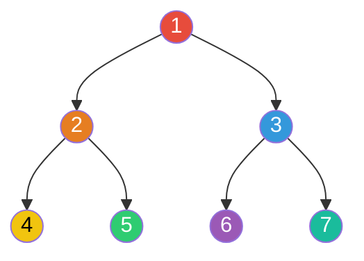
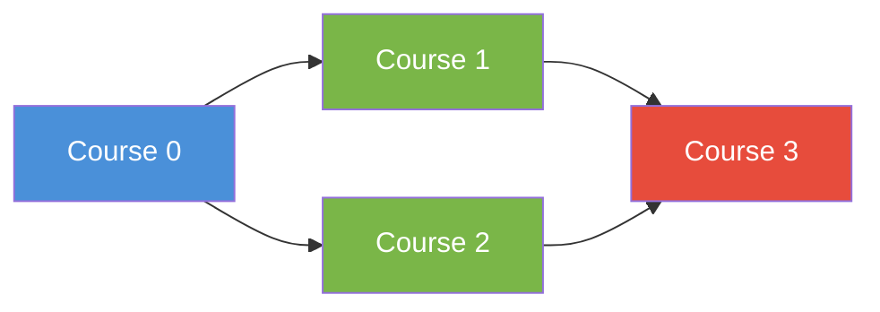
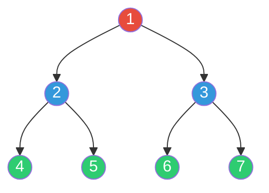
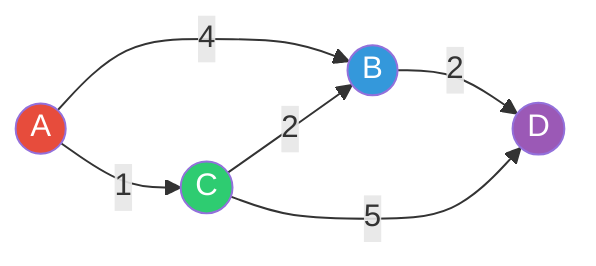

# Search Algorithms

Search algorithms are the backbone of graph and array problems in interviews. At the staff level, interviewers don't just want you to run a BFS — they want you to explain why BFS over DFS, discuss the trade-offs, and know when Dijkstra's breaks down. The difference between a senior and staff answer is recognizing that "shortest path" doesn't automatically mean Dijkstra's — it might mean BFS (unweighted), Bellman-Ford (negative weights), or even binary search on the answer space.

This guide covers every search algorithm you'll encounter in interviews, from binary search variations through weighted graph traversals.

---

## Binary Search

Binary search is deceptively deep. The basic version is trivial, but the variations — search on rotated arrays, bisect left/right, binary search on answer space — are where interviews get interesting. The core invariant: maintain a search space where the answer must exist, and halve it each step.

### Standard Binary Search

```typescript
function binarySearch(nums: number[], target: number): number {
  let lo = 0;
  let hi = nums.length - 1;
  while (lo <= hi) {
    const mid = lo + Math.floor((hi - lo) / 2); // avoid overflow (matters in other languages)
    if (nums[mid] === target) {
      return mid;
    } else if (nums[mid] < target) {
      lo = mid + 1;
    } else {
      hi = mid - 1;
    }
  }
  return -1;
}
```

### Bisect Left / Bisect Right

These find the insertion point — the first position where you could insert the target and maintain sorted order. Bisect left gives the leftmost match, bisect right gives one past the rightmost match.

```typescript
// Find the first index where nums[i] >= target
function bisectLeft(nums: number[], target: number): number {
  let lo = 0;
  let hi = nums.length;
  while (lo < hi) {
    const mid = lo + Math.floor((hi - lo) / 2);
    if (nums[mid] < target) {
      lo = mid + 1;
    } else {
      hi = mid;
    }
  }
  return lo;
}

// Find the first index where nums[i] > target
function bisectRight(nums: number[], target: number): number {
  let lo = 0;
  let hi = nums.length;
  while (lo < hi) {
    const mid = lo + Math.floor((hi - lo) / 2);
    if (nums[mid] <= target) {
      lo = mid + 1;
    } else {
      hi = mid;
    }
  }
  return lo;
}
```

**Counting occurrences in sorted array:** `bisect_right(nums, target) - bisect_left(nums, target)`.

### Search on Rotated Sorted Array

The trick: at least one half of the array around `mid` is always sorted. Determine which half is sorted, then check if the target falls within that sorted half.

```typescript
function searchRotated(nums: number[], target: number): number {
  let lo = 0;
  let hi = nums.length - 1;
  while (lo <= hi) {
    const mid = lo + Math.floor((hi - lo) / 2);
    if (nums[mid] === target) return mid;

    if (nums[lo] <= nums[mid]) {
      // Left half is sorted
      if (nums[lo] <= target && target < nums[mid]) {
        hi = mid - 1;
      } else {
        lo = mid + 1;
      }
    } else {
      // Right half is sorted
      if (nums[mid] < target && target <= nums[hi]) {
        lo = mid + 1;
      } else {
        hi = mid - 1;
      }
    }
  }
  return -1;
}
```

### Binary Search on Answer Space

One of the most powerful patterns: instead of searching through the input, binary search on the possible answer values. Works when you can frame the problem as "is answer X feasible?" and feasibility is monotonic.

```typescript
// Koko Eating Bananas: minimum eating speed to finish within h hours
function minEatingSpeed(piles: number[], h: number): number {
  let lo = 1;
  let hi = Math.max(...piles);

  while (lo < hi) {
    const mid = lo + Math.floor((hi - lo) / 2);
    const hoursNeeded = piles.reduce((sum, p) => sum + Math.ceil(p / mid), 0);
    if (hoursNeeded <= h) {
      hi = mid;      // feasible — try smaller speed
    } else {
      lo = mid + 1;  // too slow — need faster
    }
  }
  return lo;
}

// Split Array Largest Sum: minimize the largest sum among k subarrays
function splitArray(nums: number[], k: number): number {
  let lo = Math.max(...nums);
  let hi = nums.reduce((a, b) => a + b, 0);

  while (lo < hi) {
    const mid = lo + Math.floor((hi - lo) / 2);
    if (canSplit(nums, k, mid)) {
      hi = mid;
    } else {
      lo = mid + 1;
    }
  }
  return lo;
}

function canSplit(nums: number[], k: number, maxSum: number): boolean {
  let count = 1;
  let current = 0;
  for (const n of nums) {
    if (current + n > maxSum) {
      count += 1;
      current = n;
    } else {
      current += n;
    }
  }
  return count <= k;
}
```

**Interview problems:** Search in Rotated Sorted Array, Find Minimum in Rotated Sorted Array, Koko Eating Bananas, Capacity to Ship Packages, Median of Two Sorted Arrays.

---

## Depth-First Search (DFS)

DFS explores as deep as possible before backtracking. It's the natural choice for: exhaustive search, path finding, cycle detection, topological sorting, and any problem that asks "does a path/configuration exist?"

### Recursive vs Iterative



**DFS visit order: 1 → 2 → 4 → 5 → 3 → 6 → 7** (goes deep before wide)

```typescript
// Recursive DFS on a graph (adjacency list)
function dfsRecursive(
  graph: Map<number, number[]>,
  node: number,
  visited: Set<number> = new Set()
): void {
  if (visited.has(node)) return;
  visited.add(node);
  // Process node here
  for (const neighbor of graph.get(node) ?? []) {
    dfsRecursive(graph, neighbor, visited);
  }
}

// Iterative DFS — use when recursion depth might overflow the stack
function dfsIterative(graph: Map<number, number[]>, start: number): void {
  const visited = new Set<number>();
  const stack = [start];

  while (stack.length > 0) {
    const node = stack.pop()!;
    if (visited.has(node)) continue;
    visited.add(node);
    // Process node here
    for (const neighbor of graph.get(node) ?? []) {
      stack.push(neighbor);
    }
  }
}
```

### Tree Traversals

```typescript
interface TreeNode {
  val: number;
  left: TreeNode | null;
  right: TreeNode | null;
}

// Pre-order: root, left, right (used for serialization)
function preorder(root: TreeNode | null): number[] {
  if (!root) return [];
  return [root.val, ...preorder(root.left), ...preorder(root.right)];
}

// In-order: left, root, right (gives sorted order for BST)
function inorder(root: TreeNode | null): number[] {
  if (!root) return [];
  return [...inorder(root.left), root.val, ...inorder(root.right)];
}

// Post-order: left, right, root (used for deletion, expression evaluation)
function postorder(root: TreeNode | null): number[] {
  if (!root) return [];
  return [...postorder(root.left), ...postorder(root.right), root.val];
}
```

### Cycle Detection

Different approaches for directed vs undirected graphs:

```typescript
const enum VisitState { Unvisited, InProgress, Done }

// Directed graph: cycle exists if we revisit a node in the current DFS path
function hasCycleDirected(graph: Map<number, number[]>, n: number): boolean {
  const visited = new Array(n).fill(VisitState.Unvisited);

  const dfs = (node: number): boolean => {
    if (visited[node] === VisitState.InProgress) return true;  // back edge = cycle
    if (visited[node] === VisitState.Done) return false;

    visited[node] = VisitState.InProgress;
    for (const neighbor of graph.get(node) ?? []) {
      if (dfs(neighbor)) return true;
    }
    visited[node] = VisitState.Done;
    return false;
  };

  for (let i = 0; i < n; i++) {
    if (dfs(i)) return true;
  }
  return false;
}

// Undirected graph: cycle exists if we visit a node that isn't our parent
function hasCycleUndirected(graph: Map<number, number[]>, n: number): boolean {
  const visited = new Array(n).fill(false);

  const dfs = (node: number, parent: number): boolean => {
    visited[node] = true;
    for (const neighbor of graph.get(node) ?? []) {
      if (neighbor === parent) continue;
      if (visited[neighbor]) return true;
      if (dfs(neighbor, node)) return true;
    }
    return false;
  };

  for (let i = 0; i < n; i++) {
    if (!visited[i] && dfs(i, -1)) return true;
  }
  return false;
}
```

### Topological Sort

Orders vertices in a DAG so that for every edge u→v, u appears before v. Two approaches:



**Topological order: 0 → 1 → 2 → 3** (or 0 → 2 → 1 → 3)

```typescript
// Kahn's Algorithm (BFS-based) — preferred when you need to detect if a valid ordering exists
function topologicalSortKahn(graph: Map<number, number[]>, n: number): number[] {
  const inDegree = new Array(n).fill(0);
  for (const [, neighbors] of graph) {
    for (const v of neighbors) {
      inDegree[v] += 1;
    }
  }

  const queue: number[] = [];
  for (let i = 0; i < n; i++) {
    if (inDegree[i] === 0) queue.push(i);
  }
  const order: number[] = [];

  while (queue.length > 0) {
    const node = queue.shift()!;
    order.push(node);
    for (const neighbor of graph.get(node) ?? []) {
      inDegree[neighbor] -= 1;
      if (inDegree[neighbor] === 0) queue.push(neighbor);
    }
  }

  return order.length === n ? order : [];  // empty = cycle exists
}

// DFS-based topological sort
function topologicalSortDfs(graph: Map<number, number[]>, n: number): number[] {
  const visited = new Array(n).fill(false);
  const stack: number[] = [];

  const dfs = (node: number): void => {
    visited[node] = true;
    for (const neighbor of graph.get(node) ?? []) {
      if (!visited[neighbor]) dfs(neighbor);
    }
    stack.push(node);  // add to stack after all descendants are processed
  };

  for (let i = 0; i < n; i++) {
    if (!visited[i]) dfs(i);
  }
  return stack.reverse();
}
```

**Interview problems:** Number of Islands, Clone Graph, Course Schedule I/II, Pacific Atlantic Water Flow, Word Search, Surrounded Regions.

---

## Breadth-First Search (BFS)

BFS explores level by level. It naturally finds the shortest path in unweighted graphs because the first time it reaches a node, it has taken the minimum number of edges. Use BFS when you need shortest path in unweighted graphs, level-order traversal, or when the search space branches widely but the answer is shallow.



**BFS visit order: 1 → 2, 3 → 4, 5, 6, 7** (explores all neighbors before going deeper)

### Standard BFS with Distance Tracking

```typescript
function bfsShortestPath(
  graph: Map<number, number[]>,
  start: number,
  target: number
): number {
  const queue: [number, number][] = [[start, 0]];
  const visited = new Set<number>([start]);

  while (queue.length > 0) {
    const [node, dist] = queue.shift()!;
    if (node === target) return dist;

    for (const neighbor of graph.get(node) ?? []) {
      if (!visited.has(neighbor)) {
        visited.add(neighbor);
        queue.push([neighbor, dist + 1]);
      }
    }
  }
  return -1;  // unreachable
}
```

### Multi-Source BFS

Start BFS from multiple sources simultaneously. Used when you need distances from any of several starting points (e.g., "distance from nearest 0 in a matrix").

```typescript
// 01 Matrix: find distance of each cell to nearest 0
function updateMatrix(mat: number[][]): number[][] {
  const rows = mat.length;
  const cols = mat[0].length;
  const dist = Array.from({ length: rows }, () => new Array(cols).fill(Infinity));
  const queue: [number, number][] = [];

  // Enqueue ALL zeros as sources
  for (let r = 0; r < rows; r++) {
    for (let c = 0; c < cols; c++) {
      if (mat[r][c] === 0) {
        dist[r][c] = 0;
        queue.push([r, c]);
      }
    }
  }

  const dirs = [[0, 1], [0, -1], [1, 0], [-1, 0]];
  while (queue.length > 0) {
    const [r, c] = queue.shift()!;
    for (const [dr, dc] of dirs) {
      const nr = r + dr;
      const nc = c + dc;
      if (nr < 0 || nr >= rows || nc < 0 || nc >= cols) continue;
      if (dist[nr][nc] > dist[r][c] + 1) {
        dist[nr][nc] = dist[r][c] + 1;
        queue.push([nr, nc]);
      }
    }
  }
  return dist;
}
```

### 0-1 BFS

When edge weights are only 0 or 1, use a deque instead of a priority queue. Push weight-0 edges to the front, weight-1 edges to the back. Runs in O(V + E) instead of O((V+E) log V).

```typescript
function zeroOneBfs(
  graph: Map<number, [number, number][]>,
  start: number,
  n: number
): number[] {
  const dist = new Array(n).fill(Infinity);
  dist[start] = 0;
  const deque: number[] = [start];

  while (deque.length > 0) {
    const u = deque.shift()!;
    for (const [v, weight] of graph.get(u) ?? []) {  // weight is 0 or 1
      if (dist[u] + weight < dist[v]) {
        dist[v] = dist[u] + weight;
        weight === 0 ? deque.unshift(v) : deque.push(v);
      }
    }
  }
  return dist;
}
```

**Interview problems:** Binary Tree Level Order Traversal, Word Ladder, Rotting Oranges, Shortest Path in Binary Matrix, Open the Lock.

---

## DFS vs BFS: When to Use Which

| Criterion | DFS | BFS |
|---|---|---|
| **Shortest path (unweighted)** | No | Yes |
| **Memory** | O(depth) — better for deep, narrow graphs | O(width) — can blow up on wide graphs |
| **Detect cycles** | Yes (with coloring) | Yes (with in-degree for directed) |
| **Topological sort** | Yes | Yes (Kahn's) |
| **Connected components** | Yes | Yes |
| **Exhaustive search** | Preferred — natural backtracking | Possible but awkward |
| **Level-by-level processing** | Awkward | Natural |
| **Implementation** | Simpler (recursion) | Queue-based |

**Rule of thumb:** If the problem asks for shortest/minimum in an unweighted graph, use BFS. If it asks "does X exist" or "find all configurations," use DFS. If it's a tree, either works — pick whichever feels more natural for the problem.

---

## Dijkstra's Algorithm

Dijkstra's finds shortest paths from a single source in a weighted graph with **non-negative** edge weights. It's a greedy algorithm: always process the unvisited node with the smallest known distance.

### How It Works



**Step-by-step from A:**

| Step | Process | dist[A] | dist[B] | dist[C] | dist[D] |
|------|---------|---------|---------|---------|---------|
| Init | — | 0 | inf | inf | inf |
| 1 | A | 0 | 4 | 1 | inf |
| 2 | C (dist=1) | 0 | 3 | 1 | 6 |
| 3 | B (dist=3) | 0 | 3 | 1 | 5 |
| 4 | D (dist=5) | 0 | 3 | 1 | 5 |

**Shortest path A→D = 5** (via A→C→B→D, not A→C→D which is 6)

```typescript
function dijkstra(
  graph: Map<number, [number, number][]>,
  start: number,
  n: number
): number[] {
  const dist = new Array(n).fill(Infinity);
  dist[start] = 0;
  // Min-heap: [distance, node]
  // TypeScript doesn't have a built-in heap, so we use a sorted array or
  // implement with a simple priority queue
  const pq: [number, number][] = [[0, start]];
  const visited = new Set<number>();

  while (pq.length > 0) {
    // Extract minimum — in production, use a real min-heap
    pq.sort((a, b) => a[0] - b[0]);
    const [d, u] = pq.shift()!;
    if (visited.has(u)) continue;
    visited.add(u);

    for (const [v, weight] of graph.get(u) ?? []) {
      if (dist[u] + weight < dist[v]) {
        dist[v] = dist[u] + weight;
        pq.push([dist[v], v]);
      }
    }
  }
  return dist;
}
```

**Interview tip:** TypeScript lacks a built-in priority queue. In an interview, mention this and say "I'd use a min-heap here — let me simulate with a sorted structure for clarity." Interviewers care that you know the right data structure, not that your language has it built in.

### Why Negative Weights Break Dijkstra's

Dijkstra's is greedy — once a node is "visited," its distance is final. With negative edges, a later path through a negative edge could be shorter, but the algorithm won't reconsider finalized nodes.

---

## Bellman-Ford Algorithm

Bellman-Ford handles negative edge weights and detects negative cycles. It relaxes all edges V-1 times (any shortest path has at most V-1 edges). One more pass detects negative cycles.

Time: O(V * E). Slower than Dijkstra's, but more general.

```typescript
function bellmanFord(
  edges: [number, number, number][],
  n: number,
  start: number
): number[] | null {
  const dist = new Array(n).fill(Infinity);
  dist[start] = 0;

  // Relax all edges V-1 times
  for (let i = 0; i < n - 1; i++) {
    for (const [u, v, weight] of edges) {
      if (dist[u] !== Infinity && dist[u] + weight < dist[v]) {
        dist[v] = dist[u] + weight;
      }
    }
  }

  // Check for negative cycles (one more relaxation)
  for (const [u, v, weight] of edges) {
    if (dist[u] !== Infinity && dist[u] + weight < dist[v]) {
      return null;  // negative cycle detected
    }
  }

  return dist;
}
```

**When to use Bellman-Ford over Dijkstra's:**
- Graph has negative edge weights
- You need to detect negative cycles
- The problem constrains the number of edges in the path (e.g., "cheapest flight with at most K stops" — run only K iterations instead of V-1)

**Interview problems:** Cheapest Flights Within K Stops, Network Delay Time.

---

## A* Search

A* is Dijkstra's with a heuristic: it prioritizes nodes that seem closer to the goal. The priority is f(n) = g(n) + h(n) where g is the actual cost so far and h is the estimated remaining cost. If h is **admissible** (never overestimates), A* finds the optimal path.

```typescript
function aStar(
  graph: Map<number, [number, number][]>,
  start: number,
  goal: number,
  heuristic: (node: number) => number
): number {
  const dist = new Map<number, number>();
  dist.set(start, 0);
  const pq: [number, number, number][] = [[heuristic(start), 0, start]];  // [f, g, node]
  const visited = new Set<number>();

  while (pq.length > 0) {
    pq.sort((a, b) => a[0] - b[0]);
    const [, g, u] = pq.shift()!;
    if (u === goal) return g;
    if (visited.has(u)) continue;
    visited.add(u);

    for (const [v, weight] of graph.get(u) ?? []) {
      const newG = g + weight;
      if (newG < (dist.get(v) ?? Infinity)) {
        dist.set(v, newG);
        pq.push([newG + heuristic(v), newG, v]);
      }
    }
  }
  return -1;  // unreachable
}
```

**Interview context:** A* rarely appears as a coding problem but comes up in discussions about pathfinding (games, maps, robotics). Know that it reduces to Dijkstra's when h(n) = 0, and to greedy best-first search when g(n) = 0. Common heuristics: Manhattan distance (grid, 4-directional), Euclidean distance (continuous space).

---

## Algorithm Selection Guide

| Scenario | Algorithm | Time | Why |
|---|---|---|---|
| Unweighted shortest path | BFS | O(V + E) | Levels = distances |
| Weighted, non-negative | Dijkstra's | O((V+E) log V) | Greedy + min-heap |
| Weighted, negative edges | Bellman-Ford | O(V * E) | Handles negatives |
| Weighted, negative, all-pairs | Floyd-Warshall | O(V^3) | DP on intermediate nodes |
| 0/1 edge weights | 0-1 BFS | O(V + E) | Deque trick |
| Shortest with heuristic | A* | O((V+E) log V) | Guided Dijkstra's |
| "Does path exist?" | DFS | O(V + E) | Simple, low memory |
| Topological ordering | Kahn's / DFS | O(V + E) | DAG only |
| Connected components | DFS / BFS / Union-Find | O(V + E) | Any works |

---

## Study Strategy

1. **Binary search is the highest-ROI topic here.** Practice all four variants (standard, bisect left/right, rotated, answer space). Bisect left vs right off-by-one errors are the #1 source of bugs — drill until the templates are automatic.
2. **BFS and DFS are table stakes.** You should be able to write both from memory in under 2 minutes. Practice switching between them on the same problem to build intuition for when each shines.
3. **Dijkstra's comes up in ~15% of graph problems.** Know the algorithm cold, know why negative weights break it, and be ready to discuss the priority queue situation (TypeScript has no built-in heap).
4. **Bellman-Ford and A* are secondary.** Know when to reach for them and be able to sketch the approach, but you're less likely to implement them from scratch in an interview.
5. **Practice pattern:** For each algorithm, solve 3 problems. Time yourself. If you can't identify the right algorithm within 3 minutes of reading the problem, that's what to drill.

---

## Related Topics

- [[../01-data-structures-and-algorithms/index|Data Structures & Algorithms]] — foundational graph and tree structures
- [[../07-advanced-data-structures/index|Advanced Data Structures]] — Union-Find for connected components, heaps for Dijkstra's
- [[../09-dynamic-programming/index|Dynamic Programming]] — shortest path problems often have DP formulations
- [[../../system-design/01-databases-and-storage/index|Databases & Storage]] — graph databases, shortest path in distributed systems
