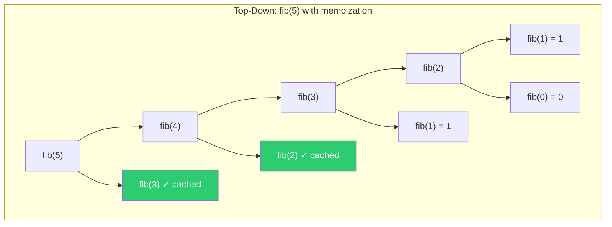
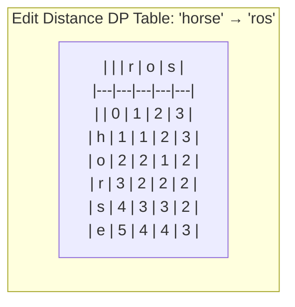
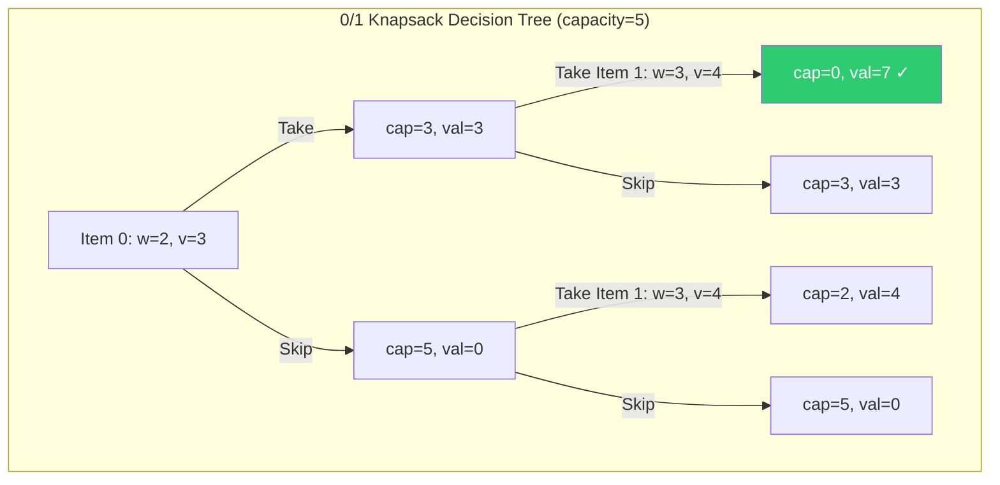
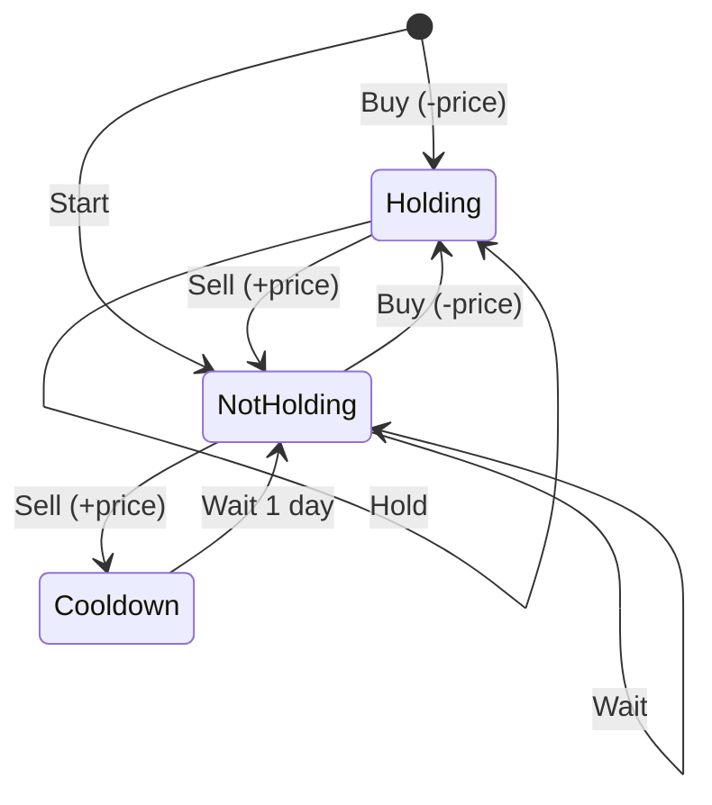

# Dynamic Programming

DP is the hardest algorithmic pattern for most candidates — not because the concept is complex, but because recognizing which subproblem to solve and defining the recurrence takes practice. The good news: there are only about 8-10 families of DP problems, and once you recognize the pattern, the implementation is mechanical.

The core idea: if a problem has **overlapping subproblems** (same computation repeated) and **optimal substructure** (optimal solution builds from optimal sub-solutions), you can solve it with DP. That's it. Everything else is pattern matching.

---

## Top-Down vs Bottom-Up

Two ways to implement the same idea:

- **Top-down (memoization):** Write the recursive solution, then cache results. Easier to think about, but has recursion overhead and stack depth limits.
- **Bottom-up (tabulation):** Fill a table from base cases forward. No recursion overhead, easier to optimize space, but requires you to figure out the iteration order.



Without memoization, fib(5) makes 15 calls. With memoization, only 6 unique calls. The savings grow exponentially.

```typescript
// Top-down: natural recursive thinking + cache
function fibMemo(n: number, memo: Map<number, number> = new Map()): number {
  if (n <= 1) return n;
  if (memo.has(n)) return memo.get(n)!;
  const result = fibMemo(n - 1, memo) + fibMemo(n - 2, memo);
  memo.set(n, result);
  return result;
}

// Bottom-up: iterative, O(1) space with rolling variables
function fibBottomUp(n: number): number {
  if (n <= 1) return n;
  let [a, b] = [0, 1];
  for (let i = 2; i <= n; i++) {
    [a, b] = [b, a + b];
  }
  return b;
}
```

**Staff-level insight:** Start with top-down in interviews. It's faster to write and easier to reason about correctness. Optimize to bottom-up if the interviewer asks for space optimization or if recursion depth is a concern.

---

## 1D Dynamic Programming

The simplest DP family. State is a single variable (usually an index or amount). Build up from base cases.

### Climbing Stairs

**State:** `dp[i]` = number of ways to reach step i. **Recurrence:** `dp[i] = dp[i-1] + dp[i-2]`.

```typescript
function climbStairs(n: number): number {
  if (n <= 1) return 1;
  let [a, b] = [1, 1];
  for (let i = 2; i <= n; i++) {
    [a, b] = [b, a + b];
  }
  return b;
}
```

### House Robber

Can't rob adjacent houses. **State:** `dp[i]` = max money robbing houses 0..i. **Recurrence:** `dp[i] = max(dp[i-1], dp[i-2] + nums[i])` — skip this house or rob it.

```typescript
function rob(nums: number[]): number {
  if (nums.length === 0) return 0;
  let [prev2, prev1] = [0, 0];
  for (const n of nums) {
    [prev2, prev1] = [prev1, Math.max(prev1, prev2 + n)];
  }
  return prev1;
}
```

### Word Break

**State:** `dp[i]` = can we segment `s[0...i]` into dictionary words? **Recurrence:** `dp[i] = true` if any `dp[j]` is true and `s[j...i]` is in the dictionary.

```typescript
function wordBreak(s: string, wordDict: string[]): boolean {
  const words = new Set(wordDict);
  const dp = new Array(s.length + 1).fill(false);
  dp[0] = true;

  for (let i = 1; i <= s.length; i++) {
    for (let j = 0; j < i; j++) {
      if (dp[j] && words.has(s.slice(j, i))) {
        dp[i] = true;
        break;
      }
    }
  }
  return dp[s.length];
}
```

### Decode Ways

**State:** `dp[i]` = number of ways to decode `s[0...i]`. A digit can be decoded alone (1-9) or as a pair (10-26).

```typescript
function numDecodings(s: string): number {
  if (s.length === 0 || s[0] === '0') return 0;
  let [prev2, prev1] = [1, 1];

  for (let i = 1; i < s.length; i++) {
    let current = 0;
    if (s[i] !== '0') current += prev1;                        // single digit
    const two = parseInt(s.slice(i - 1, i + 1));
    if (two >= 10 && two <= 26) current += prev2;              // two digits
    [prev2, prev1] = [prev1, current];
  }
  return prev1;
}
```

---

## 2D / Grid DP

State has two dimensions — usually two indices or grid coordinates.

### Edit Distance (Levenshtein)

Given two strings, find the minimum operations (insert, delete, replace) to convert one to the other. This is the quintessential 2D DP problem.

**State:** `dp[i][j]` = edit distance between `word1[0...i]` and `word2[0...j]`.

**Recurrence:**
- If `word1[i-1] == word2[j-1]`: `dp[i][j] = dp[i-1][j-1]` (no operation needed)
- Otherwise: `dp[i][j] = 1 + min(dp[i-1][j], dp[i][j-1], dp[i-1][j-1])` (delete, insert, replace)



**Answer: 3** (replace h→r, delete r, delete e)

```typescript
function minDistance(word1: string, word2: string): number {
  const m = word1.length, n = word2.length;
  const dp = Array.from({ length: m + 1 }, () => new Array(n + 1).fill(0));

  // Base cases: transforming to/from empty string
  for (let i = 0; i <= m; i++) dp[i][0] = i;
  for (let j = 0; j <= n; j++) dp[0][j] = j;

  for (let i = 1; i <= m; i++) {
    for (let j = 1; j <= n; j++) {
      if (word1[i - 1] === word2[j - 1]) {
        dp[i][j] = dp[i - 1][j - 1];
      } else {
        dp[i][j] = 1 + Math.min(
          dp[i - 1][j],      // delete from word1
          dp[i][j - 1],      // insert into word1
          dp[i - 1][j - 1]   // replace
        );
      }
    }
  }
  return dp[m][n];
}
```

### Longest Common Subsequence (LCS)

**State:** `dp[i][j]` = length of LCS of `text1[0...i]` and `text2[0...j]`.

```typescript
function longestCommonSubsequence(text1: string, text2: string): number {
  const m = text1.length, n = text2.length;
  const dp = Array.from({ length: m + 1 }, () => new Array(n + 1).fill(0));

  for (let i = 1; i <= m; i++) {
    for (let j = 1; j <= n; j++) {
      if (text1[i - 1] === text2[j - 1]) {
        dp[i][j] = dp[i - 1][j - 1] + 1;
      } else {
        dp[i][j] = Math.max(dp[i - 1][j], dp[i][j - 1]);
      }
    }
  }
  return dp[m][n];
}
```

### Unique Paths (Grid)

**State:** `dp[r][c]` = number of ways to reach cell (r,c) from (0,0) moving only right or down.

```typescript
function uniquePaths(m: number, n: number): number {
  const dp = Array.from({ length: m }, () => new Array(n).fill(1));
  for (let r = 1; r < m; r++) {
    for (let c = 1; c < n; c++) {
      dp[r][c] = dp[r - 1][c] + dp[r][c - 1];
    }
  }
  return dp[m - 1][n - 1];
}
```

---

## String DP

String problems are a major DP subcategory. The pattern: define state around string indices and build transitions based on character matches.

### Longest Palindromic Substring

**State:** `dp[i][j]` = true if `s[i..j]` is a palindrome. **Recurrence:** `dp[i][j] = (s[i] == s[j]) && dp[i+1][j-1]`.

```typescript
// Expand-around-center is simpler and faster for this specific problem
function longestPalindrome(s: string): string {
  if (s.length <= 1) return s;
  let start = 0, maxLen = 1;

  const expand = (l: number, r: number): void => {
    while (l >= 0 && r < s.length && s[l] === s[r]) {
      if (r - l + 1 > maxLen) {
        start = l;
        maxLen = r - l + 1;
      }
      l--;
      r++;
    }
  };

  for (let i = 0; i < s.length; i++) {
    expand(i, i);         // odd-length palindromes
    expand(i, i + 1);     // even-length palindromes
  }
  return s.slice(start, start + maxLen);
}
```

### Palindrome Partitioning (Minimum Cuts)

**State:** `dp[i]` = min cuts to partition `s[0...i]` into palindromes.

```typescript
function minCut(s: string): number {
  const n = s.length;
  // Precompute palindrome table
  const isPal = Array.from({ length: n }, () => new Array(n).fill(false));
  for (let i = 0; i < n; i++) isPal[i][i] = true;
  for (let i = n - 1; i >= 0; i--) {
    for (let j = i + 1; j < n; j++) {
      isPal[i][j] = s[i] === s[j] && (j - i < 3 || isPal[i + 1][j - 1]);
    }
  }

  const dp = new Array(n).fill(Infinity);
  for (let i = 0; i < n; i++) {
    if (isPal[0][i]) {
      dp[i] = 0;
    } else {
      for (let j = 1; j <= i; j++) {
        if (isPal[j][i]) dp[i] = Math.min(dp[i], dp[j - 1] + 1);
      }
    }
  }
  return dp[n - 1];
}
```

---

## Knapsack Family

The knapsack pattern is one of the most versatile DP families. Learn the 0/1 version cold — many problems reduce to it.

### 0/1 Knapsack

Each item can be taken or left. **State:** `dp[i][w]` = max value using items 0..i-1 with capacity w.



```typescript
// Space-optimized 1D approach
function knapsack(weights: number[], values: number[], capacity: number): number {
  const dp = new Array(capacity + 1).fill(0);

  for (let i = 0; i < weights.length; i++) {
    for (let c = capacity; c >= weights[i]; c--) {  // reverse to avoid using same item twice
      dp[c] = Math.max(dp[c], dp[c - weights[i]] + values[i]);
    }
  }
  return dp[capacity];
}
```

### Unbounded Knapsack (Coin Change)

Each item can be used unlimited times. Only difference: iterate capacity forward instead of backward.

```typescript
// Minimum coins to make amount
function coinChange(coins: number[], amount: number): number {
  const dp = new Array(amount + 1).fill(Infinity);
  dp[0] = 0;

  for (let a = 1; a <= amount; a++) {
    for (const coin of coins) {
      if (coin <= a) dp[a] = Math.min(dp[a], dp[a - coin] + 1);
    }
  }
  return dp[amount] === Infinity ? -1 : dp[amount];
}

// Number of ways to make amount (order doesn't matter)
function coinChangeWays(coins: number[], amount: number): number {
  const dp = new Array(amount + 1).fill(0);
  dp[0] = 1;

  for (const coin of coins) {           // outer loop on coins = combinations
    for (let a = coin; a <= amount; a++) {  // inner loop on amount
      dp[a] += dp[a - coin];
    }
  }
  return dp[amount];
}
```

**Gotcha:** Swapping the loop order (amount outer, coins inner) counts permutations instead of combinations. Interviewers love this follow-up.

### Subset Sum / Partition Equal Subset Sum

Reduce to 0/1 knapsack: can we select items that sum to exactly `target`?

```typescript
function canPartition(nums: number[]): boolean {
  const total = nums.reduce((a, b) => a + b, 0);
  if (total % 2 !== 0) return false;
  const target = total / 2;

  const dp = new Array(target + 1).fill(false);
  dp[0] = true;

  for (const num of nums) {
    for (let t = target; t >= num; t--) {
      if (dp[t - num]) dp[t] = true;
    }
  }
  return dp[target];
}
```

### Target Sum

Assign + or - to each number to reach target. Reduces to subset sum: find subset with sum `(total + target) / 2`.

```typescript
function findTargetSumWays(nums: number[], target: number): number {
  const total = nums.reduce((a, b) => a + b, 0);
  if ((total + target) % 2 !== 0 || Math.abs(total + target) < Math.abs(target)) return 0;
  const sum = (total + target) / 2;
  if (sum < 0) return 0;

  const dp = new Array(sum + 1).fill(0);
  dp[0] = 1;

  for (const num of nums) {
    for (let s = sum; s >= num; s--) {
      dp[s] += dp[s - num];
    }
  }
  return dp[sum];
}
```

---

## Interval DP

The state represents a subarray/interval `[i, j]` and you try all possible split points within it.

### Matrix Chain Multiplication / Burst Balloons

**Burst Balloons:** Pop balloons to maximize coins. When you pop balloon i, you get `nums[left] * nums[i] * nums[right]`.

**Key insight:** Think about which balloon you pop **last** in each interval, not first. The last balloon popped in interval [i,j] determines the subproblems.

```typescript
function maxCoins(nums: number[]): number {
  nums = [1, ...nums, 1];  // add boundary balloons
  const n = nums.length;
  const dp = Array.from({ length: n }, () => new Array(n).fill(0));

  // length of interval
  for (let length = 2; length < n; length++) {
    for (let i = 0; i < n - length; i++) {
      const j = i + length;
      for (let k = i + 1; k < j; k++) {  // k = last balloon popped in (i,j)
        dp[i][j] = Math.max(
          dp[i][j],
          dp[i][k] + dp[k][j] + nums[i] * nums[k] * nums[j]
        );
      }
    }
  }
  return dp[0][n - 1];
}
```

---

## Tree DP

State is defined per tree node. Solve subtrees first, then combine. Always think: "what information do I need from my children?"

### House Robber III

Can't rob directly connected parent-child pairs. For each node, track two states: max when robbing this node vs skipping it.

```typescript
interface TreeNode { val: number; left: TreeNode | null; right: TreeNode | null; }

function robTree(root: TreeNode | null): number {
  const dfs = (node: TreeNode | null): [number, number] => {
    if (!node) return [0, 0];

    const left = dfs(node.left);
    const right = dfs(node.right);

    const rob = node.val + left[1] + right[1];           // rob this node, must skip children
    const skip = Math.max(...left) + Math.max(...right);  // skip this node, free to rob or skip children
    return [rob, skip];
  };

  return Math.max(...dfs(root));
}
```

### Binary Tree Maximum Path Sum

A path can start and end at any nodes. For each node, compute the max path that passes through it, but only return the max single-branch contribution upward.

```typescript
function maxPathSum(root: TreeNode | null): number {
  let maxSum = -Infinity;

  const dfs = (node: TreeNode | null): number => {
    if (!node) return 0;

    const left = Math.max(dfs(node.left), 0);    // ignore negative branches
    const right = Math.max(dfs(node.right), 0);

    maxSum = Math.max(maxSum, left + node.val + right);  // path through this node
    return node.val + Math.max(left, right);             // best single branch upward
  };

  dfs(root);
  return maxSum;
}
```

---

## State Machine DP

Model the problem as transitions between states. The classic example: stock buying/selling problems.

### Best Time to Buy and Sell Stock (All Variants)



```typescript
// Single transaction (one buy, one sell)
function maxProfitOne(prices: number[]): number {
  let minPrice = Infinity;
  let maxProfit = 0;
  for (const price of prices) {
    minPrice = Math.min(minPrice, price);
    maxProfit = Math.max(maxProfit, price - minPrice);
  }
  return maxProfit;
}

// Unlimited transactions
function maxProfitUnlimited(prices: number[]): number {
  return prices.slice(1).reduce((sum, b, i) => sum + Math.max(b - prices[i], 0), 0);
}

// With cooldown (must wait 1 day after selling)
function maxProfitCooldown(prices: number[]): number {
  if (prices.length < 2) return 0;
  let held = -prices[0];      // holding stock
  let sold = 0;               // just sold (entering cooldown)
  let rest = 0;               // not holding, free to buy

  for (const price of prices.slice(1)) {
    const [prevHeld, prevSold, prevRest] = [held, sold, rest];
    held = Math.max(prevHeld, prevRest - price);     // keep holding or buy
    sold = prevHeld + price;                          // sell today
    rest = Math.max(prevRest, prevSold);              // stay resting or exit cooldown
  }
  return Math.max(sold, rest);
}

// At most K transactions
function maxProfitK(prices: number[], k: number): number {
  if (prices.length === 0 || k === 0) return 0;
  const n = prices.length;
  if (k >= Math.floor(n / 2)) return maxProfitUnlimited(prices);

  // dp[t][0] = max profit with t transactions, not holding
  // dp[t][1] = max profit with t transactions, holding
  const dp: [number, number][] = Array.from({ length: k + 1 }, () => [0, -Infinity]);

  for (const price of prices) {
    for (let t = 1; t <= k; t++) {
      dp[t][0] = Math.max(dp[t][0], dp[t][1] + price);      // sell
      dp[t][1] = Math.max(dp[t][1], dp[t - 1][0] - price);  // buy (uses one transaction)
    }
  }
  return dp[k][0];
}
```

---

## Bitmask DP

Use a bitmask to represent which elements of a set have been "used." State is `dp[mask]` where mask is an integer whose bits represent subset membership. Works when the set is small (n <= 20).

### Traveling Salesman Problem

Visit all cities exactly once and return to start, minimizing total distance.

**State:** `dp[mask][i]` = min cost to visit all cities in `mask`, ending at city `i`.

```typescript
function tsp(dist: number[][]): number {
  const n = dist.length;
  const fullMask = (1 << n) - 1;
  const dp = Array.from({ length: 1 << n }, () => new Array(n).fill(Infinity));
  dp[1][0] = 0;  // start at city 0

  for (let mask = 1; mask < 1 << n; mask++) {
    for (let u = 0; u < n; u++) {
      if (dp[mask][u] === Infinity) continue;
      if ((mask & (1 << u)) === 0) continue;  // u must be in mask

      for (let v = 0; v < n; v++) {
        if ((mask & (1 << v)) !== 0) continue;  // v must not be visited
        const newMask = mask | (1 << v);
        dp[newMask][v] = Math.min(dp[newMask][v], dp[mask][u] + dist[u][v]);
      }
    }
  }

  // Return to start
  let min = Infinity;
  for (let i = 0; i < n; i++) {
    min = Math.min(min, dp[fullMask][i] + dist[i][0]);
  }
  return min;
}
```

**Interview tip:** Bitmask DP problems are rare in interviews but impressive when you recognize them. The telltale sign: a problem with n <= 15-20 items where you need to track which items have been used.

---

## Space Optimization

Most 2D DP can be optimized to O(n) space by keeping only the previous row, since each cell typically depends only on the current and previous rows.

### Rolling Array Technique

```typescript
// Edit distance with O(n) space instead of O(m*n)
function minDistanceOptimized(word1: string, word2: string): number {
  const m = word1.length, n = word2.length;
  let prev = Array.from({ length: n + 1 }, (_, i) => i);
  let curr = new Array(n + 1).fill(0);

  for (let i = 1; i <= m; i++) {
    curr[0] = i;
    for (let j = 1; j <= n; j++) {
      if (word1[i - 1] === word2[j - 1]) {
        curr[j] = prev[j - 1];
      } else {
        curr[j] = 1 + Math.min(prev[j], curr[j - 1], prev[j - 1]);
      }
    }
    [prev, curr] = [curr, prev];
  }
  return prev[n];
}
```

**When to optimize:** In an interview, write the 2D version first for clarity, then offer the 1D optimization as a follow-up. Interviewers appreciate the progression from "correct" to "optimized."

---

## DP Problem Recognition Cheat Sheet

| Signal in Problem | Likely DP Pattern |
|---|---|
| "Minimum/maximum number of..." | Optimization DP (1D or 2D) |
| "How many ways to..." | Counting DP |
| "Can you reach / is it possible..." | Boolean DP (often knapsack) |
| Two strings, comparing characters | String DP (edit distance, LCS) |
| Grid with movement constraints | Grid DP |
| Items with weights and values | Knapsack |
| Can't pick adjacent elements | 1D DP (house robber pattern) |
| Interval/subarray optimization | Interval DP |
| Small set (n <= 20) with subset tracking | Bitmask DP |
| Buy/sell with states | State machine DP |
| Tree with choices at each node | Tree DP |
| Sequence of decisions over time | State machine or 1D DP |

**The two questions to ask yourself:**
1. "What is the last decision I made?" — this defines your recurrence.
2. "What do I need to remember about my past decisions?" — this defines your state.

---

## Study Strategy

1. **Start with 1D DP** (climbing stairs, house robber, coin change). These build intuition for state definition and recurrence without the complexity of multiple dimensions.
2. **Move to 2D DP** (edit distance, LCS, unique paths). Focus on filling the table by hand before coding — draw the grid, fill in values, find the pattern.
3. **Drill knapsack variants.** Once you see that subset sum, partition, coin change, and target sum are all the same problem, DP clicks.
4. **Practice the recognition step.** Given a problem statement, you should identify the DP family within 2-3 minutes. If you can't, that's what to drill.
5. **Always start top-down in interviews.** It's closer to how you think about the problem recursively. Optimize to bottom-up only if asked.
6. **Common follow-ups:** "Can you optimize space?" (rolling array), "Can you reconstruct the actual solution, not just the value?" (backtrack through the DP table), "What if the constraints change?" (different knapsack variant).

---

## Related Topics

- [[../01-data-structures-and-algorithms/index|Data Structures & Algorithms]] — prerequisite foundations
- [[../08-search-algorithms/index|Search Algorithms]] — BFS shortest path vs DP shortest path
- [[../07-advanced-data-structures/index|Advanced Data Structures]] — segment trees optimize DP range queries
