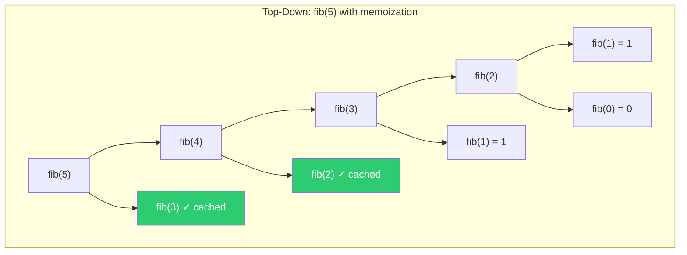
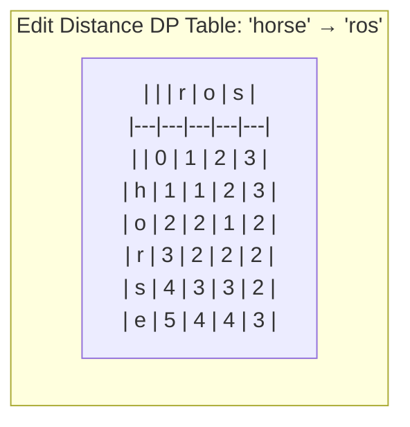
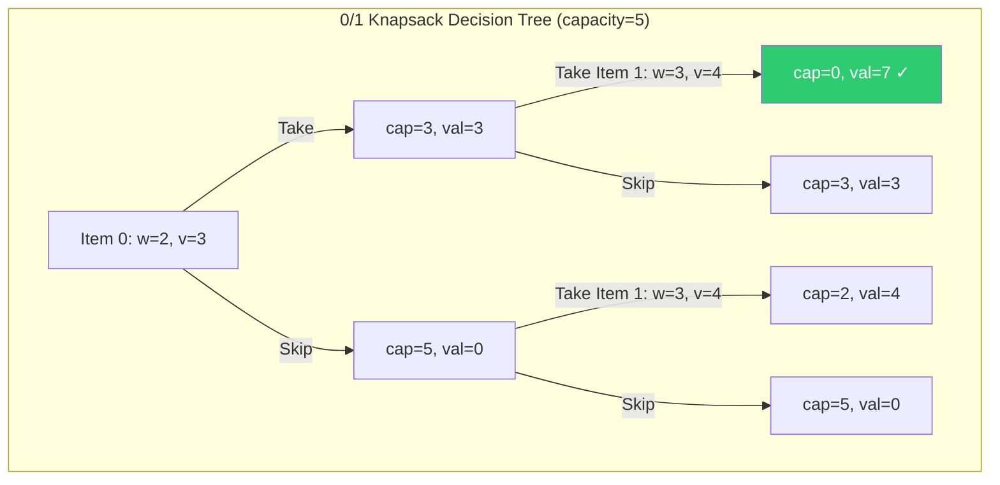
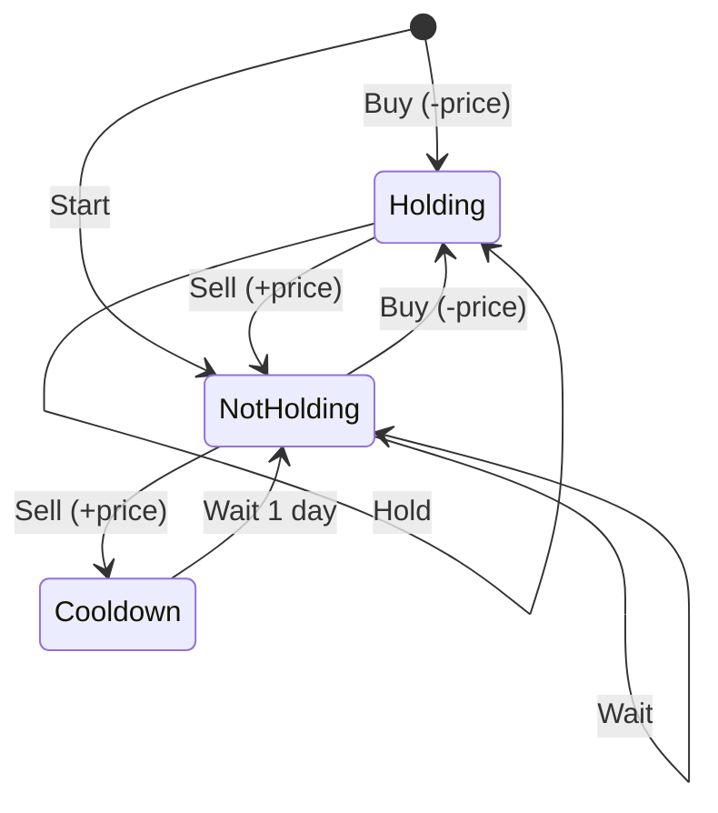

# Dynamic Programming

DP is the hardest algorithmic pattern for most candidates — not because the concept is complex, but because recognizing which subproblem to solve and defining the recurrence takes practice. The good news: there are only about 8-10 families of DP problems, and once you recognize the pattern, the implementation is mechanical.

The core idea: if a problem has **overlapping subproblems** (same computation repeated) and **optimal substructure** (optimal solution builds from optimal sub-solutions), you can solve it with DP. That's it. Everything else is pattern matching.

---

## Top-Down vs Bottom-Up

Two ways to implement the same idea:

- **Top-down (memoization):** Write the recursive solution, then cache results. Easier to think about, but has recursion overhead and stack depth limits.
- **Bottom-up (tabulation):** Fill a table from base cases forward. No recursion overhead, easier to optimize space, but requires you to figure out the iteration order.



Without memoization, fib(5) makes 15 calls. With memoization, only 6 unique calls. The savings grow exponentially.

```ruby
# Top-down: natural recursive thinking + cache
def fib_memo(n, memo = {})
  return n if n <= 1
  memo[n] ||= fib_memo(n - 1, memo) + fib_memo(n - 2, memo)
end

# Bottom-up: iterative, O(1) space with rolling variables
def fib_bottom_up(n)
  return n if n <= 1
  a, b = 0, 1
  (2..n).each { a, b = b, a + b }
  b
end
```

**Staff-level insight:** Start with top-down in interviews. It's faster to write and easier to reason about correctness. Optimize to bottom-up if the interviewer asks for space optimization or if recursion depth is a concern.

---

## 1D Dynamic Programming

The simplest DP family. State is a single variable (usually an index or amount). Build up from base cases.

### Climbing Stairs

**State:** `dp[i]` = number of ways to reach step i. **Recurrence:** `dp[i] = dp[i-1] + dp[i-2]`.

```ruby
def climb_stairs(n)
  return 1 if n <= 1
  a, b = 1, 1
  (2..n).each { a, b = b, a + b }
  b
end
```

### House Robber

Can't rob adjacent houses. **State:** `dp[i]` = max money robbing houses 0..i. **Recurrence:** `dp[i] = max(dp[i-1], dp[i-2] + nums[i])` — skip this house or rob it.

```ruby
def rob(nums)
  return 0 if nums.empty?
  prev2, prev1 = 0, 0
  nums.each do |n|
    prev2, prev1 = prev1, [prev1, prev2 + n].max
  end
  prev1
end
```

### Word Break

**State:** `dp[i]` = can we segment `s[0...i]` into dictionary words? **Recurrence:** `dp[i] = true` if any `dp[j]` is true and `s[j...i]` is in the dictionary.

```ruby
def word_break(s, word_dict)
  words = word_dict.to_set
  dp = Array.new(s.length + 1, false)
  dp[0] = true

  (1..s.length).each do |i|
    (0...i).each do |j|
      if dp[j] && words.include?(s[j...i])
        dp[i] = true
        break
      end
    end
  end
  dp[s.length]
end
```

### Decode Ways

**State:** `dp[i]` = number of ways to decode `s[0...i]`. A digit can be decoded alone (1-9) or as a pair (10-26).

```ruby
def num_decodings(s)
  return 0 if s.empty? || s[0] == '0'
  prev2, prev1 = 1, 1

  (1...s.length).each do |i|
    current = 0
    current += prev1 if s[i] != '0'                          # single digit
    two = s[i - 1..i].to_i
    current += prev2 if two >= 10 && two <= 26               # two digits
    prev2, prev1 = prev1, current
  end
  prev1
end
```

---

## 2D / Grid DP

State has two dimensions — usually two indices or grid coordinates.

### Edit Distance (Levenshtein)

Given two strings, find the minimum operations (insert, delete, replace) to convert one to the other. This is the quintessential 2D DP problem.

**State:** `dp[i][j]` = edit distance between `word1[0...i]` and `word2[0...j]`.

**Recurrence:**
- If `word1[i-1] == word2[j-1]`: `dp[i][j] = dp[i-1][j-1]` (no operation needed)
- Otherwise: `dp[i][j] = 1 + min(dp[i-1][j], dp[i][j-1], dp[i-1][j-1])` (delete, insert, replace)



**Answer: 3** (replace h→r, delete r, delete e)

```ruby
def min_distance(word1, word2)
  m, n = word1.length, word2.length
  dp = Array.new(m + 1) { Array.new(n + 1, 0) }

  # Base cases: transforming to/from empty string
  (0..m).each { |i| dp[i][0] = i }
  (0..n).each { |j| dp[0][j] = j }

  (1..m).each do |i|
    (1..n).each do |j|
      if word1[i - 1] == word2[j - 1]
        dp[i][j] = dp[i - 1][j - 1]
      else
        dp[i][j] = 1 + [
          dp[i - 1][j],      # delete from word1
          dp[i][j - 1],      # insert into word1
          dp[i - 1][j - 1]   # replace
        ].min
      end
    end
  end
  dp[m][n]
end
```

### Longest Common Subsequence (LCS)

**State:** `dp[i][j]` = length of LCS of `text1[0...i]` and `text2[0...j]`.

```ruby
def longest_common_subsequence(text1, text2)
  m, n = text1.length, text2.length
  dp = Array.new(m + 1) { Array.new(n + 1, 0) }

  (1..m).each do |i|
    (1..n).each do |j|
      dp[i][j] = if text1[i - 1] == text2[j - 1]
                   dp[i - 1][j - 1] + 1
                 else
                   [dp[i - 1][j], dp[i][j - 1]].max
                 end
    end
  end
  dp[m][n]
end
```

### Unique Paths (Grid)

**State:** `dp[r][c]` = number of ways to reach cell (r,c) from (0,0) moving only right or down.

```ruby
def unique_paths(m, n)
  dp = Array.new(m) { Array.new(n, 1) }
  (1...m).each do |r|
    (1...n).each do |c|
      dp[r][c] = dp[r - 1][c] + dp[r][c - 1]
    end
  end
  dp[m - 1][n - 1]
end
```

---

## String DP

String problems are a major DP subcategory. The pattern: define state around string indices and build transitions based on character matches.

### Longest Palindromic Substring

**State:** `dp[i][j]` = true if `s[i..j]` is a palindrome. **Recurrence:** `dp[i][j] = (s[i] == s[j]) && dp[i+1][j-1]`.

```ruby
# Expand-around-center is simpler and faster for this specific problem
def longest_palindrome(s)
  return s if s.length <= 1
  start, max_len = 0, 1

  expand = lambda do |l, r|
    while l >= 0 && r < s.length && s[l] == s[r]
      if r - l + 1 > max_len
        start = l
        max_len = r - l + 1
      end
      l -= 1
      r += 1
    end
  end

  (0...s.length).each do |i|
    expand.call(i, i)       # odd-length palindromes
    expand.call(i, i + 1)   # even-length palindromes
  end
  s[start, max_len]
end
```

### Palindrome Partitioning (Minimum Cuts)

**State:** `dp[i]` = min cuts to partition `s[0...i]` into palindromes.

```ruby
def min_cut(s)
  n = s.length
  # Precompute palindrome table
  is_pal = Array.new(n) { Array.new(n, false) }
  (0...n).each { |i| is_pal[i][i] = true }
  (n - 1).downto(0) do |i|
    (i + 1...n).each do |j|
      is_pal[i][j] = s[i] == s[j] && (j - i < 3 || is_pal[i + 1][j - 1])
    end
  end

  dp = Array.new(n, Float::INFINITY)
  (0...n).each do |i|
    if is_pal[0][i]
      dp[i] = 0
    else
      (1..i).each do |j|
        dp[i] = [dp[i], dp[j - 1] + 1].min if is_pal[j][i]
      end
    end
  end
  dp[n - 1]
end
```

---

## Knapsack Family

The knapsack pattern is one of the most versatile DP families. Learn the 0/1 version cold — many problems reduce to it.

### 0/1 Knapsack

Each item can be taken or left. **State:** `dp[i][w]` = max value using items 0..i-1 with capacity w.



```ruby
# Space-optimized 1D approach
def knapsack(weights, values, capacity)
  dp = Array.new(capacity + 1, 0)

  weights.each_with_index do |w, i|
    capacity.downto(w) do |c|  # reverse to avoid using same item twice
      dp[c] = [dp[c], dp[c - w] + values[i]].max
    end
  end
  dp[capacity]
end
```

### Unbounded Knapsack (Coin Change)

Each item can be used unlimited times. Only difference: iterate capacity forward instead of backward.

```ruby
# Minimum coins to make amount
def coin_change(coins, amount)
  dp = Array.new(amount + 1, Float::INFINITY)
  dp[0] = 0

  (1..amount).each do |a|
    coins.each do |coin|
      dp[a] = [dp[a], dp[a - coin] + 1].min if coin <= a
    end
  end
  dp[amount] == Float::INFINITY ? -1 : dp[amount]
end

# Number of ways to make amount (order doesn't matter)
def coin_change_ways(coins, amount)
  dp = Array.new(amount + 1, 0)
  dp[0] = 1

  coins.each do |coin|           # outer loop on coins = combinations
    (coin..amount).each do |a|   # inner loop on amount
      dp[a] += dp[a - coin]
    end
  end
  dp[amount]
end
```

**Gotcha:** Swapping the loop order (amount outer, coins inner) counts permutations instead of combinations. Interviewers love this follow-up.

### Subset Sum / Partition Equal Subset Sum

Reduce to 0/1 knapsack: can we select items that sum to exactly `target`?

```ruby
def can_partition(nums)
  total = nums.sum
  return false if total.odd?
  target = total / 2

  dp = Array.new(target + 1, false)
  dp[0] = true

  nums.each do |num|
    target.downto(num) do |t|
      dp[t] = true if dp[t - num]
    end
  end
  dp[target]
end
```

### Target Sum

Assign + or - to each number to reach target. Reduces to subset sum: find subset with sum `(total + target) / 2`.

```ruby
def find_target_sum_ways(nums, target)
  total = nums.sum
  return 0 if (total + target).odd? || (total + target).abs < target.abs
  sum = (total + target) / 2
  return 0 if sum < 0

  dp = Array.new(sum + 1, 0)
  dp[0] = 1

  nums.each do |num|
    sum.downto(num) do |s|
      dp[s] += dp[s - num]
    end
  end
  dp[sum]
end
```

---

## Interval DP

The state represents a subarray/interval `[i, j]` and you try all possible split points within it.

### Matrix Chain Multiplication / Burst Balloons

**Burst Balloons:** Pop balloons to maximize coins. When you pop balloon i, you get `nums[left] * nums[i] * nums[right]`.

**Key insight:** Think about which balloon you pop **last** in each interval, not first. The last balloon popped in interval [i,j] determines the subproblems.

```ruby
def max_coins(nums)
  nums = [1] + nums + [1]  # add boundary balloons
  n = nums.length
  dp = Array.new(n) { Array.new(n, 0) }

  # length of interval
  (2...n).each do |length|
    (0...(n - length)).each do |i|
      j = i + length
      (i + 1...j).each do |k|  # k = last balloon popped in (i,j)
        dp[i][j] = [
          dp[i][j],
          dp[i][k] + dp[k][j] + nums[i] * nums[k] * nums[j]
        ].max
      end
    end
  end
  dp[0][n - 1]
end
```

---

## Tree DP

State is defined per tree node. Solve subtrees first, then combine. Always think: "what information do I need from my children?"

### House Robber III

Can't rob directly connected parent-child pairs. For each node, track two states: max when robbing this node vs skipping it.

```ruby
def rob_tree(root)
  dfs(root).max
end

# Returns [rob_this_node, skip_this_node]
def dfs(node)
  return [0, 0] unless node

  left = dfs(node.left)
  right = dfs(node.right)

  rob = node.val + left[1] + right[1]       # rob this node, must skip children
  skip = left.max + right.max               # skip this node, free to rob or skip children
  [rob, skip]
end
```

### Binary Tree Maximum Path Sum

A path can start and end at any nodes. For each node, compute the max path that passes through it, but only return the max single-branch contribution upward.

```ruby
def max_path_sum(root)
  @max = -Float::INFINITY

  dfs = lambda do |node|
    return 0 unless node

    left = [dfs.call(node.left), 0].max    # ignore negative branches
    right = [dfs.call(node.right), 0].max

    @max = [@max, left + node.val + right].max  # path through this node
    node.val + [left, right].max                # best single branch upward
  end

  dfs.call(root)
  @max
end
```

---

## State Machine DP

Model the problem as transitions between states. The classic example: stock buying/selling problems.

### Best Time to Buy and Sell Stock (All Variants)



```ruby
# Single transaction (one buy, one sell)
def max_profit_one(prices)
  min_price = Float::INFINITY
  max_profit = 0
  prices.each do |price|
    min_price = [min_price, price].min
    max_profit = [max_profit, price - min_price].max
  end
  max_profit
end

# Unlimited transactions
def max_profit_unlimited(prices)
  prices.each_cons(2).sum { |a, b| [b - a, 0].max }
end

# With cooldown (must wait 1 day after selling)
def max_profit_cooldown(prices)
  return 0 if prices.length < 2
  held = -prices[0]      # holding stock
  sold = 0               # just sold (entering cooldown)
  rest = 0               # not holding, free to buy

  prices[1..].each do |price|
    prev_held, prev_sold, prev_rest = held, sold, rest
    held = [prev_held, prev_rest - price].max     # keep holding or buy
    sold = prev_held + price                       # sell today
    rest = [prev_rest, prev_sold].max              # stay resting or exit cooldown
  end
  [sold, rest].max
end

# At most K transactions
def max_profit_k(prices, k)
  return 0 if prices.empty? || k == 0
  n = prices.length
  return max_profit_unlimited(prices) if k >= n / 2

  # dp[t][0] = max profit with t transactions, not holding
  # dp[t][1] = max profit with t transactions, holding
  dp = Array.new(k + 1) { [0, -Float::INFINITY] }

  prices.each do |price|
    (1..k).each do |t|
      dp[t][0] = [dp[t][0], dp[t][1] + price].max      # sell
      dp[t][1] = [dp[t][1], dp[t - 1][0] - price].max  # buy (uses one transaction)
    end
  end
  dp[k][0]
end
```

---

## Bitmask DP

Use a bitmask to represent which elements of a set have been "used." State is `dp[mask]` where mask is an integer whose bits represent subset membership. Works when the set is small (n <= 20).

### Traveling Salesman Problem

Visit all cities exactly once and return to start, minimizing total distance.

**State:** `dp[mask][i]` = min cost to visit all cities in `mask`, ending at city `i`.

```ruby
def tsp(dist)
  n = dist.length
  full_mask = (1 << n) - 1
  dp = Array.new(1 << n) { Array.new(n, Float::INFINITY) }
  dp[1][0] = 0  # start at city 0

  (1...1 << n).each do |mask|
    (0...n).each do |u|
      next if dp[mask][u] == Float::INFINITY
      next unless mask & (1 << u) != 0  # u must be in mask

      (0...n).each do |v|
        next if mask & (1 << v) != 0  # v must not be visited
        new_mask = mask | (1 << v)
        dp[new_mask][v] = [dp[new_mask][v], dp[mask][u] + dist[u][v]].min
      end
    end
  end

  # Return to start
  (0...n).map { |i| dp[full_mask][i] + dist[i][0] }.min
end
```

**Interview tip:** Bitmask DP problems are rare in interviews but impressive when you recognize them. The telltale sign: a problem with n <= 15-20 items where you need to track which items have been used.

---

## Space Optimization

Most 2D DP can be optimized to O(n) space by keeping only the previous row, since each cell typically depends only on the current and previous rows.

### Rolling Array Technique

```ruby
# Edit distance with O(n) space instead of O(m*n)
def min_distance_optimized(word1, word2)
  m, n = word1.length, word2.length
  prev = (0..n).to_a
  curr = Array.new(n + 1, 0)

  (1..m).each do |i|
    curr[0] = i
    (1..n).each do |j|
      if word1[i - 1] == word2[j - 1]
        curr[j] = prev[j - 1]
      else
        curr[j] = 1 + [prev[j], curr[j - 1], prev[j - 1]].min
      end
    end
    prev, curr = curr, prev
  end
  prev[n]
end
```

**When to optimize:** In an interview, write the 2D version first for clarity, then offer the 1D optimization as a follow-up. Interviewers appreciate the progression from "correct" to "optimized."

---

## DP Problem Recognition Cheat Sheet

| Signal in Problem | Likely DP Pattern |
|---|---|
| "Minimum/maximum number of..." | Optimization DP (1D or 2D) |
| "How many ways to..." | Counting DP |
| "Can you reach / is it possible..." | Boolean DP (often knapsack) |
| Two strings, comparing characters | String DP (edit distance, LCS) |
| Grid with movement constraints | Grid DP |
| Items with weights and values | Knapsack |
| Can't pick adjacent elements | 1D DP (house robber pattern) |
| Interval/subarray optimization | Interval DP |
| Small set (n <= 20) with subset tracking | Bitmask DP |
| Buy/sell with states | State machine DP |
| Tree with choices at each node | Tree DP |
| Sequence of decisions over time | State machine or 1D DP |

**The two questions to ask yourself:**
1. "What is the last decision I made?" — this defines your recurrence.
2. "What do I need to remember about my past decisions?" — this defines your state.

---

## Study Strategy

1. **Start with 1D DP** (climbing stairs, house robber, coin change). These build intuition for state definition and recurrence without the complexity of multiple dimensions.
2. **Move to 2D DP** (edit distance, LCS, unique paths). Focus on filling the table by hand before coding — draw the grid, fill in values, find the pattern.
3. **Drill knapsack variants.** Once you see that subset sum, partition, coin change, and target sum are all the same problem, DP clicks.
4. **Practice the recognition step.** Given a problem statement, you should identify the DP family within 2-3 minutes. If you can't, that's what to drill.
5. **Always start top-down in interviews.** It's closer to how you think about the problem recursively. Optimize to bottom-up only if asked.
6. **Common follow-ups:** "Can you optimize space?" (rolling array), "Can you reconstruct the actual solution, not just the value?" (backtrack through the DP table), "What if the constraints change?" (different knapsack variant).

---

## Related Topics

- [[../01-data-structures-and-algorithms/index|Data Structures & Algorithms]] — prerequisite foundations
- [[../08-search-algorithms/index|Search Algorithms]] — BFS shortest path vs DP shortest path
- [[../07-advanced-data-structures/index|Advanced Data Structures]] — segment trees optimize DP range queries
